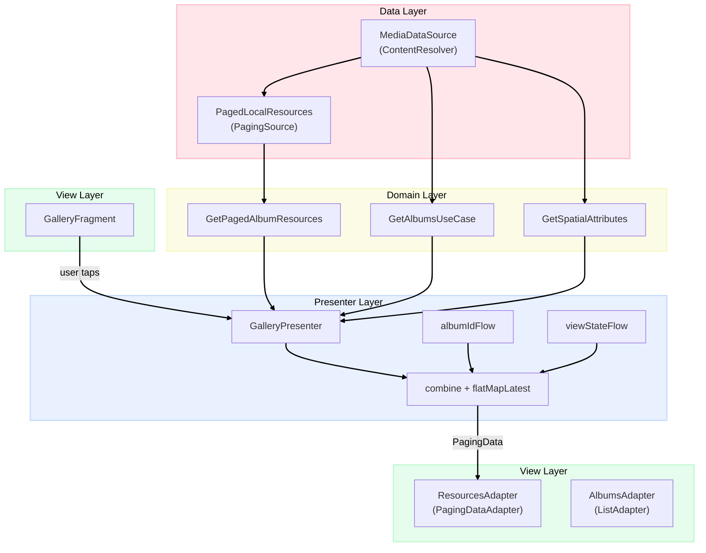
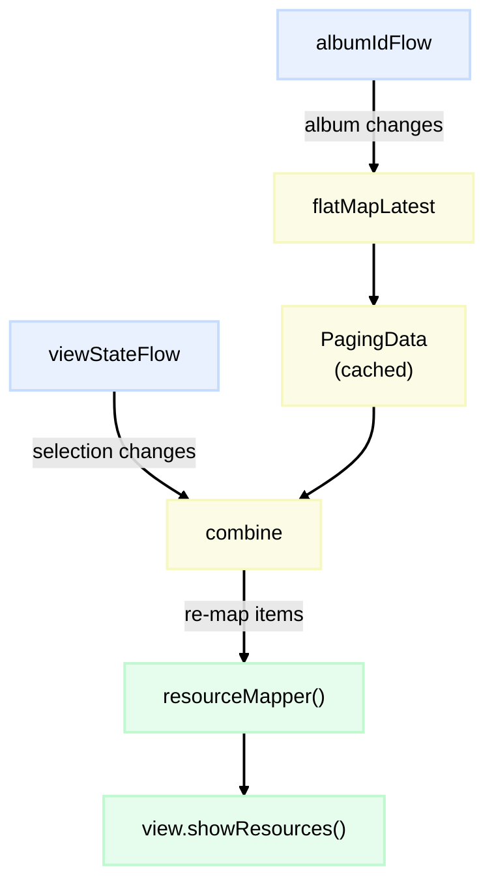
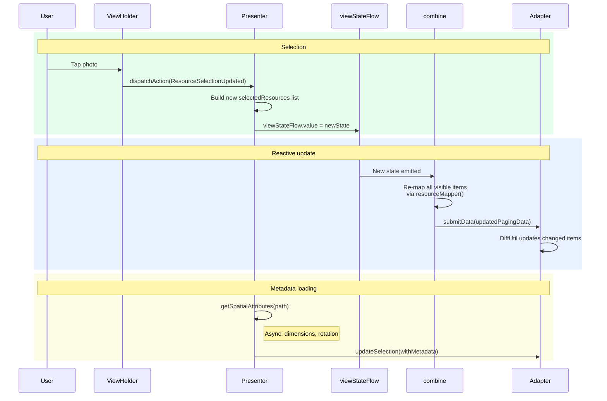

Storybeat lets users build video stories from their camera roll — pick some photos, pick some videos, arrange them, add filters and music, export. The first step in that flow is always the gallery picker: a grid of thumbnails the user scrolls through, taps to select, and sends to the editor.

It sounds like a solved problem. Android even ships a system photo picker. But once you add multi-select with numbered badges, album switching, video filtering, and a grid that needs to stay smooth across a gallery of ten thousand items — you're building something more interesting than it first appears.

This is how we built ours, using Paging 3, Kotlin Flow, and a presenter that ties them together.


## What Made It Tricky

The gallery grid is a RecyclerView backed by paginated data from MediaStore. Items scroll in and out of memory constantly. The user might select photo #3, scroll five screens down, select photo #47, then scroll back. Photo #3 still needs to show badge "1", photo #47 needs badge "2", and every item in between needs to know whether it's selected or not — all while the adapter is loading and recycling pages of data underneath.

The core tension is between two things that change independently: the paginated data (which grows as the user scrolls) and the selection state (which changes on every tap). Keeping them in sync without manual invalidation or full-list refreshes was the main design challenge.


## The Shape of It

The architecture follows a pretty standard layered approach — MediaStore at the bottom, a use case wrapping Paging 3 in the middle, a presenter orchestrating the reactive flows, and a thin fragment on top:



Nothing unusual here. The interesting part is what happens inside the presenter.


## Reading from MediaStore with Paging 3

At the bottom of the stack, a `PagingSource` reads photos and videos from MediaStore using cursor-based pagination. Android's MediaStore is essentially a SQL database of media metadata, and Paging 3 gives us a way to query it in chunks:

```kotlin
class PagedLocalResources(
    private val albumId: Long,
    private val isVideoAllowed: Boolean,
    private val mediaSource: MediaDataSource
) : PagingSource<Int, LocalResource>() {

    private var initialLoadSize = 0

    override suspend fun load(
        params: LoadParams<Int>
    ): LoadResult<Int, LocalResource> {
        return try {
            if (params.key == null) {
                initialLoadSize = params.loadSize
            }
            val currentPageNumber = params.key ?: 0

            val resources = mediaSource.getResourcesByAlbum(
                albumId,
                params.loadSize,
                currentPageNumber * params.loadSize
                    + (initialLoadSize - params.loadSize),
                isVideoAllowed
            )

            LoadResult.Page(
                data = resources,
                prevKey = if (currentPageNumber == 0) null
                          else currentPageNumber - 1,
                nextKey = if (resources.size < params.loadSize) null
                          else currentPageNumber + 1
            )
        } catch (e: Exception) {
            LoadResult.Error(e)
        }
    }
}
```

There's a subtle offset correction in that `initialLoadSize` tracking. Paging 3 loads a larger first page to fill the screen immediately, then switches to smaller pages for subsequent loads. Without compensating for that difference, page 2 would overlap with page 1's data. It's the kind of bug that only shows up when you're scrolling fast through a large gallery — duplicate items flickering in and out.

The use case wrapping this configures the pager with numbers tuned for a 4-column grid:

```kotlin
class GetPagedAlbumResources @Inject constructor(
    private val mediaPhotosStorage: MediaDataSource,
    @DefaultDispatcher defaultDispatcher: CoroutineDispatcher
) : UseCase<Pair<Long, Boolean>, Flow<PagingData<LocalResource>>>(
    defaultDispatcher
) {
    private val pagedListConfig = PagingConfig(
        initialLoadSize = 60,
        prefetchDistance = 20,
        pageSize = 40,
        enablePlaceholders = false
    )

    override fun execute(
        parameters: Pair<Long, Boolean>
    ): Flow<PagingData<LocalResource>> {
        val (albumId, isVideoAllowed) = parameters
        return Pager(pagedListConfig) {
            PagedLocalResources(albumId, isVideoAllowed, mediaPhotosStorage)
        }.flow
    }
}
```

60 items upfront fills roughly 15 rows — enough to cover any screen size without a visible loading state. A prefetch distance of 20 gives about five rows of buffer before the next page triggers. These numbers came from testing on a few devices; the goal was to make pagination invisible to the user.


## The Reactive Pipeline

The presenter is where the two independent streams — paged data and selection state — come together. It manages two `MutableStateFlow`s: one for the current album ID, one for the view state that includes selection:

```kotlin
class GalleryPresenter @Inject constructor(
    private val getPagedAlbumResources: GetPagedAlbumResources,
    private val getAlbumsUseCase: GetAlbumsUseCase,
    private val getImageSpatialAttributes: GetImageSpatialAttributes,
    private val getVideoSpatialAttributes: GetVideoSpatialAttributes,
    private val addResources: AddResources,
    @DefaultDispatcher private val defaultDispatcher: CoroutineDispatcher
) : BasePresenter<GalleryPresenter.View>() {

    var viewState: GalleryViewState = getInitViewState()
    private var viewStateFlow = MutableStateFlow(getInitViewState())
    private var albumIdFlow = MutableStateFlow(viewState.selectedAlbumId)
}
```

The method that wires these together is `configurePagingFlow`, and it's the core of the whole architecture:

```kotlin
@OptIn(ExperimentalCoroutinesApi::class)
private suspend fun configurePagingFlow() {
    val resources = albumIdFlow
        .map { albumId ->
            getPagedAlbumResources(albumId to viewState.isVideoAllowed)
        }
        .filter { it is Result.Success }
        .flatMapLatest { it.data!! }
        .cachedIn(this)

    val filteredResources = viewStateFlow
        .combine(resources) { state, pagingData ->
            pagingData.map { resourceMapper(it, state) }
        }
        .flowOn(defaultDispatcher)

    filteredResources.distinctUntilChanged().collectLatest {
        view.showResources(it)
    }
}
```

Three operators do most of the work here.

`flatMapLatest` handles album switching. When the user picks a different album, the album ID flow emits, `flatMapLatest` cancels the previous paging flow and starts a new one. No manual cleanup, no stale data from the previous album leaking through.

`combine` is what keeps selection and pagination in sync. Every time either stream emits — a new page loads, or the user taps an item — the combine block re-maps every visible item through `resourceMapper`. This is where selection badges get their numbers.

`cachedIn(this)` is easy to overlook but essential. Without it, every time the combine re-collects (because selection changed), Paging 3 would restart pagination from scratch. `cachedIn` keeps the loaded pages alive across recompositions of the flow pipeline.

The reactive flow looks like this:




## The Resource Mapper

This pure function is what makes badge numbering work across paginated data:

```kotlin
fun resourceMapper(
    entry: LocalResource,
    state: GalleryViewState
): GalleryViewModel {
    val viewModel = entry.toViewModel()
    val index = state.selectedResources.indexOfFirst { selected ->
        selected.id == viewModel.id
    }
    return GalleryViewModel(
        resource = viewModel.copy(selectedNumber = index + 1),
        isEnabled = (viewModel.isPhoto || state.isVideoAllowed)
    )
}
```

It takes a domain model and the current view state, and returns a UI model with the correct badge number. If the item isn't selected, `indexOfFirst` returns -1, so `selectedNumber` becomes 0 (no badge). If it's the third selected item, `selectedNumber` is 3.

The key property is that this function is pure — same inputs, same outputs, no side effects. When the combine block re-maps all visible items after a selection change, it's just running this function across the current page. DiffUtil then figures out which ViewHolders actually changed and updates only those.


## What Happens on a Tap

To see how it all connects, here's the full data flow when a user selects a photo:



The tap triggers a state change, the state change triggers a reactive update through combine, and DiffUtil handles the minimal UI diff. Meanwhile, spatial metadata (image dimensions, EXIF orientation) loads asynchronously in the background — the editor needs this data later, but the gallery doesn't have to wait for it.


## Actions as a Sealed Class

State transitions go through a sealed class that makes every possible operation explicit:

```kotlin
sealed class GalleryAction {
    data class Init(
        val galleryMode: GalleryMode,
        val isVideoAllowed: Boolean
    ) : GalleryAction()

    object GetAlbums : GalleryAction()
    data class GetResourcesByAlbum(val albumId: Long) : GalleryAction()
    data class FilterResources(val isVideoAllowed: Boolean) : GalleryAction()
    data class ConfigureGallery(
        val maxSelectedResources: Int,
        val selectedResources: List<ResourceViewModel>
    ) : GalleryAction()
    data class ResourceSelectionUpdated(
        val resource: ResourceViewModel,
        val isSelected: Boolean
    ) : GalleryAction()
}
```

The presenter processes each action and may update both the imperative `viewState` (for synchronous reads) and the reactive `viewStateFlow` (to trigger the combine pipeline):

```kotlin
fun dispatchAction(action: GalleryAction) {
    launch {
        execOperation(action, viewState)?.let {
            viewState = it
        }
    }
}
```

This dual-write pattern — imperative and reactive — isn't the cleanest thing in the codebase. Ideally the imperative `viewState` wouldn't exist and everything would flow through the reactive stream. But in practice, some code paths needed synchronous access to the current state, and this pragmatic split worked well enough.


## Single vs. Multi-Select

The gallery supports two selection modes through a sealed class:

```kotlin
sealed class GalleryMode : Serializable {
    data class MultiSelection(val embed: Boolean = false) : GalleryMode()
    data class SingleSelection(val placeholderOrder: Int = 0) : GalleryMode()
}
```

In `SingleSelection`, the presenter caps `selectedResourcesAllowed` at 1 and immediately forwards the resource to the editor — no "Continue" button needed. In `MultiSelection`, users see numbered badges and a confirmation step. The adapter dims items at 80% opacity once the selection limit is reached, a small visual cue that I initially thought was unnecessary but turned out to prevent a lot of confusion in user testing.


## RecyclerView Tuning

The fragment sets up the grid with a few performance knobs:

```kotlin
photosRecycler.apply {
    layoutManager = GridLayoutManager(context, 4)
    setHasFixedSize(true)
    recycledViewPool.setMaxRecycledViews(0, 4 * 20)
    setItemViewCacheSize(20)
}
```

80 ViewHolders in the recycled pool (20 rows of a 4-column grid) is aggressive, but gallery scrolling is one of those interactions where users immediately notice jank. Keeping a large pool means fewer ViewHolder inflations during fast flings. Combined with the shared Glide request builder in the adapter, the gallery stayed smooth even on budget devices with galleries of several thousand items.

The adapter itself creates one Glide configuration and passes it to every ViewHolder:

```kotlin
class ResourcesAdapter(
    context: Context,
    private val selectionMode: GalleryMode,
    private val onSelectionUpdated: (ResourceViewModel, Boolean) -> Unit
) : PagingDataAdapter<GalleryViewModel, GalleryItemViewHolder>(ResourceDiff) {

    private val resourceSize = Dimensions.dp2px(context, 60)

    private val fullRequest = GlideApp.with(context)
        .asDrawable()
        .centerCrop()
        .override(resourceSize)
        .priority(Priority.HIGH)
        .diskCacheStrategy(DiskCacheStrategy.RESOURCE)

    override fun onCreateViewHolder(parent: ViewGroup, viewType: Int) =
        GalleryItemViewHolder(inflateView(parent), fullRequest)
}
```

No per-bind allocation. The ViewHolder just calls `fullRequest.load(uri).into(imageView)` with the caching, sizing, and transformation already configured.


## Testing

Because the presenter is a plain Kotlin class with injected dependencies, testing it doesn't require an emulator or Robolectric. The reactive pipeline runs on a `TestCoroutineDispatcher`, and the `resourceMapper` is a pure function that can be tested in complete isolation:

```kotlin
@Test
fun `selecting a resource updates the view`() = runBlockingTest {
    val resource = FakeMediaDataSource.resourcesAlbum1[1].toViewModel()

    presenter.dispatchAction(
        GalleryAction.ResourceSelectionUpdated(resource, true)
    )

    verify(view).updateSelection(listOf(resource))
    assertTrue(presenter.viewState.selectedResources.contains(resource))
}

@Test
fun `resourceMapper marks selected items with correct badge number`() {
    val resources = FakeMediaDataSource.resourcesAlbum1
    val selected = resources[1].toViewModel()
    presenter.viewState = presenter.viewState.copy(
        selectedResources = listOf(selected)
    )

    val mapped = resources.map {
        presenter.resourceMapper(it, presenter.viewState)
    }

    assertEquals(0, mapped[0].resource.selectedNumber)
    assertEquals(1, mapped[1].resource.selectedNumber)
}
```

The `resourceMapper` test is my favorite kind of test — it verifies real business logic (badge numbering across a list) with no mocks, no coroutines, no framework dependencies. Just inputs and outputs.


## Learnings

Before landing on this approach, we tried manual invalidation — updating specific adapter positions when selection changed. It worked for simple cases but broke down with multi-select across pages: items that hadn't been bound yet wouldn't pick up the selection, and items that had been recycled would show stale badges when scrolled back into view.

The reactive approach solves all of that by treating the problem as what it actually is: two streams of data that need to be merged. Paging provides the content, the state flow provides the selection, and `combine` merges them. When either changes, everything recalculates. It's not the most efficient approach in theory — you're re-mapping the entire visible page on every tap — but in practice, `resourceMapper` is cheap and DiffUtil only touches the items that actually changed.

The other thing worth noting is how much testability you get for free from this structure. The presenter is a plain Kotlin class, the mapper is a pure function, and the reactive pipeline runs on a test dispatcher. We didn't design for testability explicitly — it fell out of separating concerns and keeping the state transformations functional. That's a pattern I want to keep applying: when the architecture is right, testing becomes a side effect rather than an afterthought.


#### Links

- [Storybeat](https://www.storybeat.com/)
- [Paging 3 Documentation](https://developer.android.com/topic/libraries/architecture/paging/v3-overview)
- [Kotlin Flow](https://kotlinlang.org/docs/flow.html)
