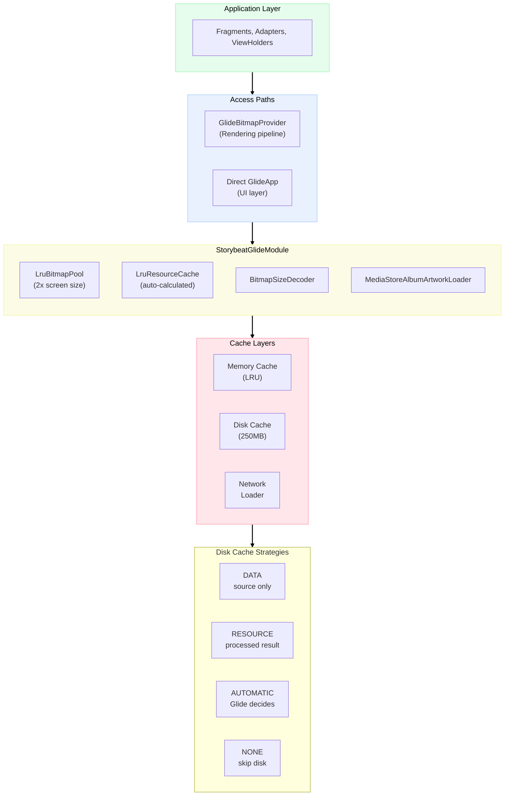
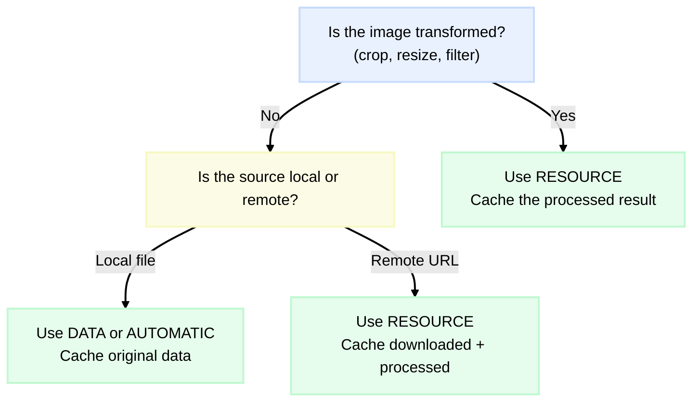

A video editor doesn't just deal with video. Before a single frame is rendered, there are gallery thumbnails to load, album covers to display, sticker previews to show, and filter samples to present. At Storybeat, image loading was everywhere — and in a media-heavy app running on mid-range Android devices, how you load and cache those images matters more than you'd think.

We used [Glide](https://github.com/bumptech/glide) as our image loading library. It's a reasonable default for most Android apps, but a video editor pushes it in ways a typical gallery app doesn't. We needed synchronous bitmap loading for the OpenGL pipeline, batch operations for slideshow exports, and enough control over the cache to avoid running out of memory during recording.

This is a walkthrough of the caching architecture we ended up with — the custom Glide module, the disk cache strategies, the abstraction layer we built on top, and the few custom components we wrote to fill the gaps.

## The Glide Module

Glide lets you configure its internals through a custom `AppGlideModule`. We used this to tune the bitmap pool and memory cache for our workload:

```kotlin
@GlideModule
class StorybeatGlideModule : AppGlideModule() {

    override fun applyOptions(context: Context, builder: GlideBuilder) {
        val calculator = MemorySizeCalculator.Builder(context)
            .setBitmapPoolScreens(2f)
            .build()

        builder.setBitmapPool(LruBitmapPool(calculator.bitmapPoolSize.toLong()))
        builder.setMemoryCache(LruResourceCache(calculator.memoryCacheSize.toLong()))
    }

    override fun registerComponents(context: Context, glide: Glide, registry: Registry) {
        registry.prepend(
            File::class.java, BitmapSizeInfo::class.java,
            BitmapSizeDecoder()
        )

        if (Build.VERSION.SDK_INT >= Build.VERSION_CODES.Q) {
            registry.prepend(
                Uri::class.java,
                InputStream::class.java,
                MediaStoreAlbumArtworkLoader.InputStreamFactory(context.contentResolver)
            )
        }
    }
}
```

The bitmap pool is set to 2x the screen size. This might seem aggressive, but in a video editor you're constantly applying transformations — crops, filters, letterboxing — and each one needs a temporary bitmap. A larger pool means Glide can reuse existing allocations instead of creating new ones. The memory cache is left to Glide's `MemorySizeCalculator`, which adjusts based on device RAM.

The `registerComponents` method is where things get more specific to our use case. We registered two custom components — a `BitmapSizeDecoder` for reading image dimensions without loading full bitmaps, and a `MediaStoreAlbumArtworkLoader` for dealing with Android Q's new content access restrictions. More on both of those later.

## How It All Fits Together

The architecture has two paths into Glide: a direct one for UI-level loading (gallery thumbnails, album art), and an abstraction layer called `GlideBitmapProvider` for the rendering pipeline. Both go through the same custom Glide module and hit the same cache layers:



The disk cache is where most of the interesting decisions happen. Glide offers four strategies, and we ended up using three of them depending on the context.


## Picking the Right Disk Cache Strategy

The decision tree looks roughly like this: if the image goes through any transformation before display, cache the processed result. If you're just reading metadata, cache the source. If you're not sure, let Glide decide.



In practice, `RESOURCE` was our most common strategy. Gallery thumbnails, audio album art, sticker previews — they all go through at least a `centerCrop` or `override` before displaying. Caching the transformed result means Glide skips the transformation on the next load:

```kotlin
GlideApp.with(context)
    .asDrawable()
    .centerCrop()
    .override(resourceSize)
    .diskCacheStrategy(DiskCacheStrategy.RESOURCE)
    .load(imageUri)
    .into(imageView)
```

`DATA` was reserved for the `BitmapSizeDecoder`, which only reads image dimensions without decoding the full bitmap. Caching the original source makes sense here since there's no transformation to preserve:

```kotlin
private val sizeOptions = RequestOptions()
    .skipMemoryCache(true)
    .diskCacheStrategy(DiskCacheStrategy.DATA)
```

And `AUTOMATIC` appeared in a few places where the image source could be either local or remote — album covers being the main example. Glide uses `DATA` for local files and `RESOURCE` for remote ones, which is a reasonable heuristic we didn't need to second-guess.


## The BitmapProvider Abstraction

The rendering pipeline needed bitmaps in a very different way than the UI. RecyclerView adapters load images asynchronously into ImageViews, which Glide handles natively. But the OpenGL renderer needed bitmaps synchronously, on demand, with exact dimensions — and it needed to load batches of them in parallel during slideshow exports.

We wrapped Glide in a `BitmapProvider` interface:

```kotlin
class GlideBitmapProvider(private val activity: Activity) : BitmapProvider {

    private var cachedTargets: Map<String, FutureTarget<Bitmap>> = mapOf()

    override fun getBitmapFrom(
        imageUrl: String,
        targetWidth: Int,
        targetHeight: Int
    ): Bitmap {
        val target = GlideApp.with(activity)
            .asBitmap()
            .centerCrop()
            .diskCacheStrategy(DiskCacheStrategy.RESOURCE)
            .override(targetWidth, targetHeight)
            .load(imageUrl)
            .submit()

        cachedTargets = cachedTargets + (
            getCacheId(imageUrl, targetWidth, targetHeight) to target
        )

        return target.get()  // Blocking call
    }

    override suspend fun getBitmapsFrom(
        images: List<Pair<String, Dimension>>,
        dispatcher: CoroutineDispatcher
    ): List<Bitmap> {
        return withContext(dispatcher) {
            images
                .map { async { getBitmapFrom(it.first, it.second.width, it.second.height) } }
                .map { it.await() }
        }
    }
}
```

The `submit()` + `get()` pattern gives us a blocking call, which is what the OpenGL thread expects. The batch method wraps those blocking calls in coroutines so slideshow exports can load multiple frames in parallel.

There's a manual target cache here that might look odd — why track `FutureTarget` references ourselves? The answer is lifecycle management. Glide ties its cleanup to Activities, but during recording the OpenGL thread can outlive the UI. Tracking targets explicitly lets us clear them when the recording finishes, not just when the Activity is destroyed:

```kotlin
class GlideBitmapProvider : BitmapProvider, DefaultLifecycleObserver {

    override fun onDestroy(owner: LifecycleOwner) {
        clear()
    }

    private fun clear() {
        cachedTargets.forEach { GlideApp.with(activity).clear(it.value) }
        cachedTargets = mapOf()
    }
}
```


## Custom Components

Two platform issues required us to extend Glide with custom components.

### BitmapSizeDecoder

The preview screen needed image dimensions to calculate aspect ratios and layout positions before actually loading the full bitmap. Android's `BitmapFactory` supports this through `inJustDecodeBounds` — a flag that reads the file header for width and height without allocating the full bitmap:

```kotlin
class BitmapSizeDecoder : ResourceDecoder<File, BitmapSizeInfo> {
    override fun decode(
        file: File, width: Int, height: Int, options: Options
    ): Resource<BitmapSizeInfo> {
        val bmOptions = BitmapFactory.Options()
        bmOptions.inJustDecodeBounds = true
        val rotation = getExifOrientation(file.path)
        BitmapFactory.decodeFile(file.absolutePath, bmOptions)

        return SimpleResource(
            BitmapSizeInfo(
                Size(bmOptions.outWidth, bmOptions.outHeight),
                rotation
            )
        )
    }
}
```

Registering this as a Glide decoder meant we could request `BitmapSizeInfo` the same way we request any other resource — through Glide's pipeline, with the same caching and lifecycle management.

### MediaStoreAlbumArtworkLoader

Android Q changed how apps access media files. Direct file paths to album artwork stopped working, and everything had to go through `ContentResolver`. Our album cover loading broke overnight on Android 10 devices:

```kotlin
@RequiresApi(Build.VERSION_CODES.Q)
class MediaStoreAlbumArtworkLoader(
    private val resolver: ContentResolver
) : ModelLoader<Uri, InputStream> {

    override fun handles(model: Uri): Boolean =
        ContentResolver.SCHEME_CONTENT == model.scheme &&
        MediaStore.AUTHORITY == model.authority &&
        "audio" in model.pathSegments
}
```

Plugging this into Glide's registry meant the rest of the app didn't need to know about the Android Q change. The same `load(albumArtUri)` call worked on all API levels — Glide routed it to our custom loader on Q+ and used the default path on older versions.


## RecyclerView Patterns

Two patterns came up repeatedly in how we used Glide with lists.

The first was preloading. Glide integrates with RecyclerView through `ListPreloader`, which lets you start loading images for items that are about to scroll into view:

```kotlin
class AudioListAdapter : ListAdapter, ListPreloader.PreloadModelProvider<String> {

    private val options = RequestOptions()
        .transform(RoundedCorners(4.dp))
        .override(thumbSize, thumbSize)
        .diskCacheStrategy(DiskCacheStrategy.RESOURCE)

    override fun getPreloadItems(position: Int): List<String> {
        return listOfNotNull(currentList[position].audio.thumbnail)
    }

    override fun getPreloadRequestBuilder(item: String): RequestBuilder<Drawable> {
        return Glide.with(context).load(item).apply(options)
    }
}
```

The second was reusable request builders. Instead of configuring Glide from scratch in every `onBindViewHolder`, we created the request once and reused it:

```kotlin
class ResourcesAdapter(context: Context) {

    private val resourceSize = Dimensions.dp2px(context, 60)

    private val fullRequest = GlideApp.with(context)
        .asDrawable()
        .centerCrop()
        .override(resourceSize)
        .priority(Priority.HIGH)
        .diskCacheStrategy(DiskCacheStrategy.RESOURCE)

    override fun onCreateViewHolder(parent: ViewGroup, viewType: Int) =
        GalleryItemViewHolder(inflateView(), fullRequest)
}
```

Both patterns are standard Glide usage, nothing revolutionary. But in a gallery with hundreds of media items, the difference between jittery and smooth scrolling often comes down to these details.


## Conclusions

This setup served us well for the three years I worked on Storybeat. The `BitmapProvider` abstraction turned out to be one of those decisions that kept paying off — when we added unit tests for the rendering pipeline, we could swap in a fake provider that returned solid-color bitmaps without touching Glide at all.

The disk cache strategy choices were mostly intuitive once we understood the trade-offs. `RESOURCE` for anything transformed, `DATA` for metadata, `AUTOMATIC` when you're unsure. The decision tree isn't complex, but being deliberate about it avoided the kind of mysterious "why is this image stale?" bugs that come from leaving caching to defaults.

#### Links

- [Storybeat](https://www.storybeat.com/)
- [Glide](https://github.com/bumptech/glide)
- [Coil](https://coil-kt.github.io/coil/)
