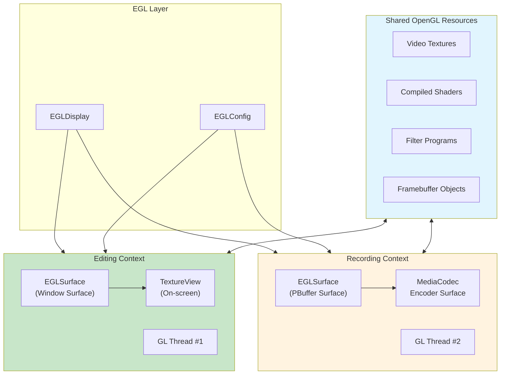
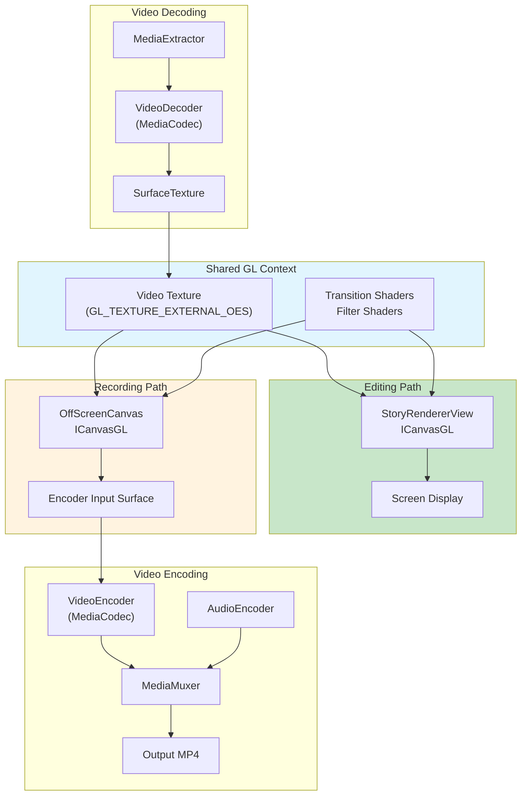
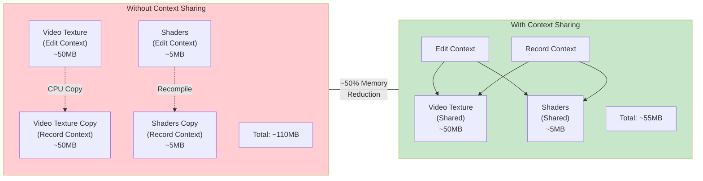

When I joined [Storybeat](https://www.storybeat.com/), we were a tiny team of two developers. The app existed as a basic MVP built on top of [FFmpeg](https://github.com/FFmpeg/FFmpeg), but slow. Rendering a 15-second video could take over a minute. Users would tap "Export" and wait, staring at a progress bar, hoping their phone wouldn't fall asleep.

We knew this wasn't sustainable. As we planned new features—transitions, filters, stickers, text overlays—the FFmpeg approach would only get slower. We needed a different foundation.

So I did what any reasonable developer would do: I rewrote the entire rendering pipeline from scratch using OpenGL.

## Why OpenGL?

Using the regular Android UI framework for an editor involves decoding frames to bitmaps, manipulating them on CPU, then encoding them back. This works, but it's slow and memory-hungry. Every frame makes a round trip: **GPU → CPU → GPU**.

OpenGL lets you stay on the GPU. Decode a video frame? It lands in a texture. Apply a filter? That's a shader. Composite multiple layers? More shaders. Encode the result? The encoder reads directly from the GPU surface.

No round trips. No bitmap allocations. No waiting.

But OpenGL comes with complexity. You're managing EGL contexts, shader programs, texture lifecycles, and frame synchronization. Everything should be moved or resized using matrix transformations. It's a steep learning curve for what seems like a simple goal: make videos faster.

The payoff, though, was worth it.

## The Architecture That Made It Work

After months of iteration, we landed on an architecture built around two key ideas. We built on top of [ChillingVan's android-openGL-canvas](https://github.com/ChillingVan/android-openGL-canvas) library, which provided an excellent Canvas-like API for OpenGL operations. But the real breakthrough was extending it to support shared contexts between different rendering surfaces.

### Idea #1: One Canvas, Many Surfaces

Every video editor faces the same problem: you need to render the same content to different places.

- **Editing**: Render to the screen so users can preview their work
- **Recording**: Render to a video file for export
- **Thumbnails**: Render to a small bitmap for the gallery

The naive approach is to write separate rendering code for each. But that leads to bugs ("why does my export look different from the preview?") and maintenance nightmares.

Our solution was to abstract the rendering target behind a common interface. We called it `ICanvasGL`:

```kotlin
interface ICanvasGL {
    val width: Int
    val height: Int

    fun drawBitmap(bitmap: Bitmap, x: Int, y: Int, w: Int, h: Int, filter: TextureFilter)
    fun drawRect(rect: Rect, paint: GLPaint)
    fun save()
    fun restore()
    fun rotate(degrees: Float, px: Float, py: Float)
    fun clearBuffer(color: Int)
}
```

This looks like Android's regular `Canvas` API, but it runs on OpenGL. Any code that draws to `ICanvasGL` works identically whether the target is a `TextureView` on screen, an off-screen buffer for recording, or a small surface for thumbnail generation.

We built a family of renderers that all target this interface:

```kotlin
class SlideshowRenderer(private val bitmapProvider: BitmapProvider) {

    private var slideShowFilter: TwoTextureFilter = NoEffectFilter()

    fun drawOn(
        canvas: ICanvasGL,  // Works with ANY ICanvasGL implementation
        elapsedTime: Milliseconds,
        storyDuration: Milliseconds,
        imageUrls: List<String>,
        filterGroup: FilterGroup
    ) {
        val progress = getTransitionProgress(elapsedTime, imageUrls.size, storyDuration)
        (slideShowFilter as OneValueFilter).setValue(progress)
        canvas.drawBitmap(currentBitmap, 0, 0, canvas.width, canvas.height, slideShowFilter)
    }
}
```

The renderer doesn't know or care where it's drawing. Screen? Video file? Thumbnail? Same code, same result.

This became especially powerful for time-sensitive content like animated GIFs:

```kotlin
class OverlayRenderer(private val bitmapProvider: BitmapProvider) {

    fun drawOn(canvas: ICanvasGL, presentationTimeMs: Milliseconds) {
        layers.forEach { layer ->
            // Only render if within layer's time span
            if (presentationTimeMs in layer.startAt..layer.stopAt) {
                when (layer) {
                    is Layer.Sticker -> {
                        // Get the correct GIF frame for this exact timestamp
                        val frame = gifFrameProvider.getNextFrame(presentationTimeMs - layer.startAt)
                        drawTexture(canvas, frame, layer)
                    }
                    else -> drawBitmap(canvas, layer.data, layer)
                }
            }
        }
    }
}
```

During editing, `presentationTimeMs` comes from the system clock. During recording, it comes from the video encoder's frame counter. The renderer doesn't care—it just draws the right frame for the given timestamp.


### Idea #2: Shared OpenGL Context

Here's where things get interesting.

When you create an OpenGL context, you get your own isolated world of textures, shaders, and buffers. If you create a second context for recording, it can't see anything from the first. You'd have to copy textures between them—exactly the kind of GPU → CPU → GPU round trip we were trying to avoid.

But OpenGL has a feature called **context sharing**. Two contexts can share the same resources if you set them up correctly.

This was the breakthrough.



When a video decoder produces a frame, it writes to a texture. That texture is visible to *both* contexts. During editing, we read it and composite it onto the screen. During recording, we read the *same texture* and composite it into the export.

No copying. No duplication. One texture, two readers.

Here's how we set up the shared context:

```kotlin
class MultiTexOffScreenCanvas(
    var width: Int = 0,
    var height: Int = 0,
    private val initialTexCount: Int = 0,
    renderMode: Int = GLThread.RENDERMODE_WHEN_DIRTY,
    sharedEglContext: EglContextWrapper = EglContextWrapper.EGL_NO_CONTEXT_WRAPPER
) : GLViewRenderer {

    init {
        val builder = GLThread.Builder()
            .setRenderMode(renderMode)
            .setSharedEglContext(sharedEglContext)  // Share with editing context
            .setRenderer(this)

        mGLThread = builder.createGLThread()
        mGLThread.start()
    }
}
```

The recording surface receives the editing context's `EglContextWrapper`. From that point on, they share resources: textures created in one context are visible in the other, shaders compiled once are used everywhere, and video frames stay on the GPU throughout the entire pipeline.

For off-screen rendering without a window, we use EGL PBuffer surfaces:

```kotlin
private inner class SurfaceFactory : GLThread.EGLWindowSurfaceFactory {
    override fun createWindowSurface(
        egl: EGL10,
        display: EGLDisplay,
        config: EGLConfig,
        nativeWindow: Any?
    ): EGLSurface {
        val attributes = intArrayOf(
            EGL10.EGL_WIDTH, width,
            EGL10.EGL_HEIGHT, height,
            EGL10.EGL_NONE
        )
        // PBuffer = off-screen, in-memory surface (no window required)
        return egl.eglCreatePbufferSurface(display, config, attributes)
    }
}
```

## How Recording Works

With these two ideas in place, recording becomes surprisingly simple.

The `StoryRendererView`—our main editing surface—implements a `CanvasFrameRecorder` interface, making it both the preview renderer and the recording renderer:

```kotlin
@AndroidEntryPoint
class StoryRendererView : GLMultiTexProducerView, CanvasFrameRecorder {

    // Same renderers used for BOTH editing and recording
    private val slideshowRenderer = SlideshowRenderer(bitmapProvider)
    private val overlayRenderer = OverlayRenderer(bitmapProvider)
    private val placeholderRenderer = PlaceholderRenderer()
    private val trendRenderer = TrendRenderer(bitmapProvider)

    // Called 60x per second during editing
    override fun onGLDraw(
        canvas: ICanvasGL,
        producedTextures: List<GLTexture>,
        consumedTextures: List<GLTexture>
    ) {
        drawFrameOnCanvas(canvas, producedTextures, elapsedTime)
    }

    // Called 30x per second during recording
    override fun drawFrameForRecording(
        canvas: ICanvasGL,  // This is OffScreenCanvas, not the view
        videoTextures: List<GLTexture>,
        extraTextures: List<GLTexture>,
        presentationTimeMs: Milliseconds
    ) {
        drawFrameOnCanvas(canvas, videoTextures, presentationTimeMs)
        overlayRenderer.drawOn(canvas, presentationTimeMs)
    }

    // Shared rendering logic—identical for both modes
    private fun drawFrameOnCanvas(
        canvas: ICanvasGL,
        videoTextures: List<GLTexture>,
        presentationTimeMs: Milliseconds
    ) {
        canvas.drawRect(Rect(0, 0, canvas.width, canvas.height), bgPaint)

        layers.forEach { layer ->
            when (layer) {
                is Layer.Placeholder -> placeholderRenderer.drawOn(canvas, layer, videoTextures)
                is Layer.Slideshow -> slideshowRenderer.drawOn(canvas, presentationTimeMs, ...)
                is Layer.Trend -> trendRenderer.drawOn(canvas, layer, presentationTimeMs)
            }
        }
    }
}
```

The recording pipeline orchestrates everything:

```kotlin
internal class CanvasRecorder(
    private val mediaMuxer: EncodeMediaMuxer,
    private val fileManager: FileManager
) {
    private lateinit var encoder: Encoder
    private lateinit var outputSurface: VideoRenderOutputSurface
    private lateinit var offscreenCanvas: OffScreenCanvas

    fun init(width: Int, height: Int, videos: List<Video>, onDrawListener: OnCanvasDrawCallback?) {
        // 1. Create H.264 encoder
        encoder = DualMediaCodec()
        encoder.init(getOutputMediaFormat(width, height), MediaCodecActionType.ENCODE)

        // 2. Wrap encoder's input surface for EGL rendering
        outputSurface = VideoRenderOutputSurface(encoder.createInputSurface())

        // 3. Create off-screen canvas with SHARED context
        offscreenCanvas = OffScreenCanvas(width, height, videos.size)
        offscreenCanvas.onDrawListener = ::onGLDraw

        // 4. Video decoders output directly to canvas textures
        videoDecoders = videos.mapIndexed { index, video ->
            VideoDecoder(fileManager).apply {
                init(video, Surface(offscreenCanvas.producedTextureList[index].surfaceTexture))
            }
        }
    }

    fun processNextFrame(): Int {
        // Decode video frame → shared texture
        val drawResult = videoDecoders.first().processNextFrame()

        if (drawResult == RESULT_FRAME_PROCESSED) {
            // Composite all layers via the same renderers used for editing
            offscreenCanvas.drawFrame()

            // Send to encoder with precise timestamp
            outputSurface.setPresentationTime(elapsedTimeUs * 1000)
            outputSurface.swapBuffers()
        }

        return writeEncodedOutputFrame(durationUs, encoder)
    }
}
```

The flow is straightforward:



The same renderers that drew to the screen now draw to the recording buffer. The same textures that displayed the preview now feed the export. The same shaders that applied filters live now apply them in the video file.

**What you see is exactly what you get.**

## The Results

This architecture powered Storybeat through three years of development. We added features that would have been painful with the old approach:

- **GL Transitions**: Fade, zoom, warp, morph—all running as fragment shaders
- **Real-time Filters**: Color grading, blur, vignette—previewed live, exported identically
- **Animated Stickers**: GIFs composited at the correct frame for each timestamp
- **Multi-video Templates**: Multiple video tracks decoded and composited in sync

Performance improved dramatically. Export time dropped from 60+ seconds to near-realtime for simple stories. Memory during export fell by roughly 40% thanks to texture sharing—no more duplicating video frames between contexts. And preview quality remained full resolution, full framerate, with no compromises.



The app eventually reached over **10 million downloads** with a **4.5-star rating** from more than 300,000 reviews. Users created millions of stories without ever knowing about the OpenGL pipeline underneath.


## What I Learned

**Abstract early.** Creating `ICanvasGL` as the rendering target abstraction was the best early decision. It forced every renderer to be surface-agnostic from day one, which made recording "just work" when we built it months later.

**Invest in foundations.** The weeks spent understanding EGL contexts and shader compilation felt slow at the time. But that knowledge paid dividends for years—every new feature built on that foundation without requiring architectural changes.

**Stay on the GPU.** Every time you move data between GPU and CPU, you pay a price in latency and memory bandwidth. Design your pipeline to minimize those crossings. Video frames should flow from decoder → texture → shader → encoder without ever touching main memory.

**WYSIWYG is non-negotiable.** Users trust that what they see is what they'll get. Using the same rendering code for preview and export guarantees this—not through careful testing, but through architectural design.

## Acknowledgments

We built on top of [ChillingVan's android-openGL-canvas](https://github.com/ChillingVan/android-openGL-canvas) library, which provided an excellent Canvas-like API for OpenGL. We extended it for multi-surface rendering and context sharing, but the foundation saved us months of work.

#### Links

- [Storybeat](https://www.storybeat.com/)
- [OpenGl Canvas Lib](https://github.com/ChillingVan/android-openGL-canvas)