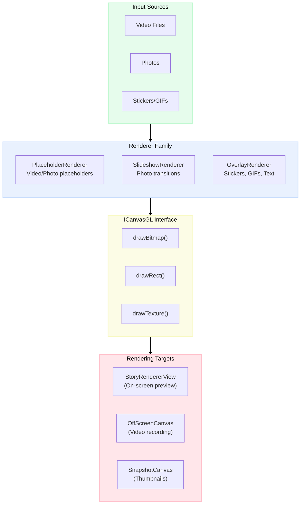
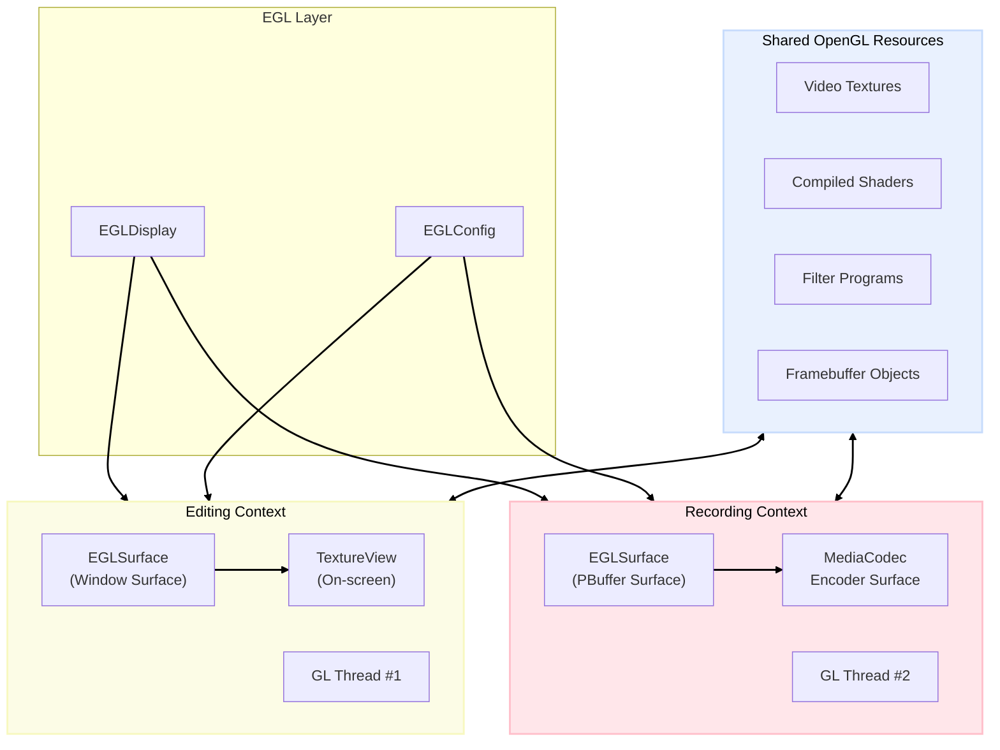
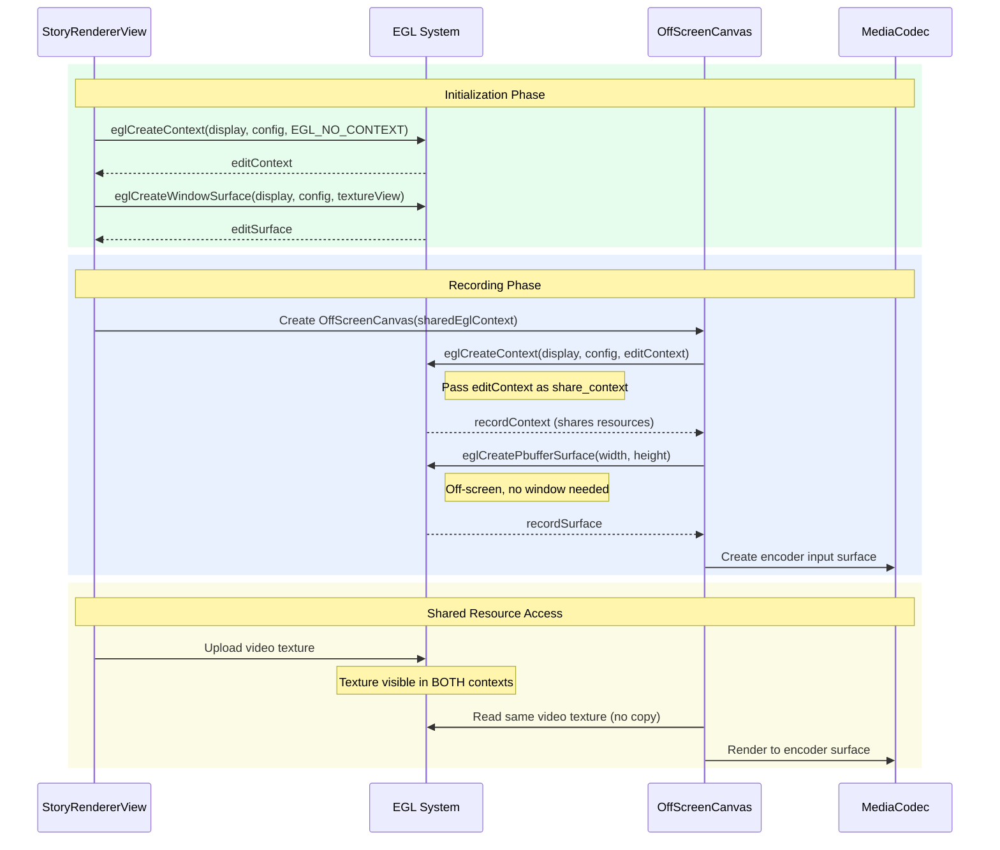
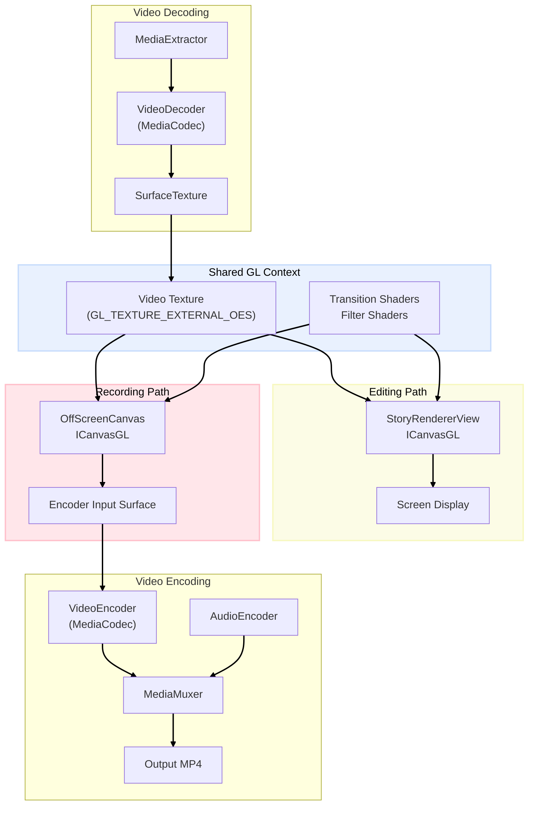
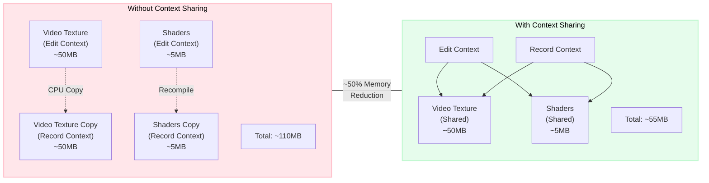

When I joined [Storybeat](https://www.storybeat.com/), we were a tiny team of two developers. The app existed as a basic MVP built on top of [FFmpeg](https://github.com/FFmpeg/FFmpeg), but slow. Rendering a 15-second video could take over a minute. Users would tap "Export" and wait, staring at a progress bar, hoping their phone wouldn't fall asleep.

We knew this wasn't sustainable. As we planned new features—transitions, filters, stickers, text overlays—the FFmpeg approach would only get slower. We needed a different foundation.

I started looking into OpenGL as an alternative. The idea was straightforward: if video frames already live on the GPU, why move them to the CPU just to move them back? It turned out to be a much deeper rabbit hole than expected.

## Why OpenGL?

Using the regular Android UI framework for an editor involves decoding frames to bitmaps, manipulating them on CPU, then encoding them back. This works, but it's slow and memory-hungry. Every frame makes a round trip: **GPU → CPU → GPU**.

OpenGL lets you stay on the GPU. Decode a video frame? It lands in a texture. Apply a filter? That's a shader. Composite multiple layers? More shaders. Encode the result? The encoder reads directly from the GPU surface.

No round trips. No bitmap allocations. No waiting.

But OpenGL comes with complexity. You're managing EGL contexts, shader programs, texture lifecycles, and frame synchronization. Everything should be moved or resized using matrix transformations. It's a steep learning curve for what seems like a simple goal: make videos faster.

It took me a while to feel comfortable in that world, but the investment started paying off once the basic pipeline was in place.

## How the Architecture Evolved

After months of iteration, two patterns emerged that shaped the rest of the project. We built on top of [ChillingVan's android-openGL-canvas](https://github.com/ChillingVan/android-openGL-canvas) library, which provided an excellent Canvas-like API for OpenGL operations. But the real discovery was figuring out how to extend it for shared contexts between different rendering surfaces.

### Idea #1: One Canvas, Many Surfaces

Every video editor faces the same problem: you need to render the same content to different places.

- **Editing**: Render to the screen so users can preview their work
- **Recording**: Render to a video file for export
- **Thumbnails**: Render to a small bitmap for the gallery

The naive approach is to write separate rendering code for each. We tried this initially and quickly ran into the classic problem: "why does my export look different from the preview?"

The solution we landed on was abstracting the rendering target behind a common interface. We called it `ICanvasGL`:

```kotlin
interface ICanvasGL {
    val width: Int
    val height: Int

    fun drawBitmap(bitmap: Bitmap, x: Int, y: Int, w: Int, h: Int, filter: TextureFilter)
    fun drawRect(rect: Rect, paint: GLPaint)
    fun save()
    fun restore()
    fun rotate(degrees: Float, px: Float, py: Float)
    fun clearBuffer(color: Int)
}
```

This looks like Android's regular `Canvas` API, but it runs on OpenGL. Any code that draws to `ICanvasGL` works identically whether the target is a `TextureView` on screen, an off-screen buffer for recording, or a small surface for thumbnail generation.

We built a family of renderers around this interface — each one responsible for a different content type (photos, video placeholders, animated stickers, transitions), but all of them drawing through `ICanvasGL` without knowing what's on the other side:



The key property: no renderer knows or cares where it's drawing. Screen? Video file? Thumbnail? Same code, same result.

Where this matters most is time-sensitive content. Take animated GIFs — each sticker needs to show the right frame for a given moment in the video:

```kotlin
class OverlayRenderer(private val bitmapProvider: BitmapProvider) {

    fun drawOn(canvas: ICanvasGL, presentationTimeMs: Milliseconds) {
        layers.forEach { layer ->
            // Only render if within layer's time span
            if (presentationTimeMs in layer.startAt..layer.stopAt) {
                when (layer) {
                    is Layer.Sticker -> {
                        // Get the correct GIF frame for this exact timestamp
                        val frame = gifFrameProvider.getNextFrame(presentationTimeMs - layer.startAt)
                        drawTexture(canvas, frame, layer)
                    }
                    else -> drawBitmap(canvas, layer.data, layer)
                }
            }
        }
    }
}
```

During editing, `presentationTimeMs` comes from the system clock. During recording, it comes from the video encoder's frame counter. The renderer doesn't care — it draws the right frame for the given timestamp. This small detail turned out to be surprisingly important: it meant that GIF stickers, transition effects, and every other time-dependent element stayed perfectly synchronized between preview and export, without any extra logic on our side.

With this abstraction working, we had a clean rendering layer. But there was still a problem: how do you share GPU resources between the editing surface and the recording surface?


### Idea #2: Discovering Shared OpenGL Contexts

This part took me longer to figure out than I'd like to admit.

When you create an OpenGL context, you get your own isolated world of textures, shaders, and buffers. If you create a second context for recording, it can't see anything from the first. You'd have to copy textures between them—exactly the kind of GPU → CPU → GPU round trip we were trying to avoid.

I spent a few days stuck on this until I found that OpenGL has a feature called **context sharing**. Two contexts can share the same resources if you set them up correctly. Once I understood how it worked, a lot of the architecture fell into place.



When a video decoder produces a frame, it writes to a texture. That texture is visible to *both* contexts. During editing, we read it and composite it onto the screen. During recording, we read the *same texture* and composite it into the export.

No copying. No duplication. One texture, two readers.

Here's how we set up the shared context:

```kotlin
class MultiTexOffScreenCanvas(
    var width: Int = 0,
    var height: Int = 0,
    private val initialTexCount: Int = 0,
    renderMode: Int = GLThread.RENDERMODE_WHEN_DIRTY,
    sharedEglContext: EglContextWrapper = EglContextWrapper.EGL_NO_CONTEXT_WRAPPER
) : GLViewRenderer {

    init {
        val builder = GLThread.Builder()
            .setRenderMode(renderMode)
            .setSharedEglContext(sharedEglContext)  // Share with editing context
            .setRenderer(this)

        mGLThread = builder.createGLThread()
        mGLThread.start()
    }
}
```

The recording surface receives the editing context's `EglContextWrapper`. From that point on, they share resources: textures created in one context are visible in the other, shaders compiled once are used everywhere, and video frames stay on the GPU throughout the entire pipeline.

The initialization sequence looks like this — the important moment is when the recording context is created with a reference to the editing context:



There's a subtle detail in that sequence worth highlighting. The recording context doesn't render to a window — there's nothing to display on screen. Instead, it uses an EGL PBuffer surface: an off-screen, in-memory rendering target. This is how we render frames that go directly to the video encoder without ever touching the display:

```kotlin
private inner class SurfaceFactory : GLThread.EGLWindowSurfaceFactory {
    override fun createWindowSurface(
        egl: EGL10,
        display: EGLDisplay,
        config: EGLConfig,
        nativeWindow: Any?
    ): EGLSurface {
        val attributes = intArrayOf(
            EGL10.EGL_WIDTH, width,
            EGL10.EGL_HEIGHT, height,
            EGL10.EGL_NONE
        )
        // PBuffer = off-screen, in-memory surface (no window required)
        return egl.eglCreatePbufferSurface(display, config, attributes)
    }
}
```

## How Recording Works

With those two patterns in place, the recording side turned out to be simpler than I initially expected.

The `StoryRendererView` — our main editing surface — implements a `CanvasFrameRecorder` interface, making it both the preview renderer and the recording source. The core idea is that both paths converge on the same drawing function:

```kotlin
// Pseudocode — simplified from actual implementation
class StoryRendererView : GLMultiTexProducerView, CanvasFrameRecorder {

    // During editing (60 FPS): canvas targets the screen
    override fun onGLDraw(canvas: ICanvasGL, textures: List<GLTexture>) {
        drawFrame(canvas, textures, elapsedTime)
    }

    // During recording (30 FPS): canvas targets the encoder
    override fun drawFrameForRecording(canvas: ICanvasGL, textures: List<GLTexture>, timeMs: Milliseconds) {
        drawFrame(canvas, textures, timeMs)
        overlayRenderer.drawOn(canvas, timeMs)
    }

    // Same renderers, same logic, different target
    private fun drawFrame(canvas: ICanvasGL, textures: List<GLTexture>, timeMs: Milliseconds) {
        canvas.clearBuffer(backgroundColor)
        layers.forEach { layer ->
            layer.renderer.drawOn(canvas, layer, timeMs)
        }
    }
}
```

Both `onGLDraw` and `drawFrameForRecording` call the same `drawFrame` method. The only difference is *where the canvas points* and *where the timestamp comes from*. This is where the `ICanvasGL` abstraction and the shared context come together — the renderers don't need to know anything about the recording pipeline.

The recording pipeline then orchestrates the rest — setting up the encoder, connecting the decoder outputs to shared textures, and driving the frame-by-frame loop:

```kotlin
internal class CanvasRecorder(
    private val mediaMuxer: EncodeMediaMuxer,
    private val fileManager: FileManager
) {
    private lateinit var encoder: Encoder
    private lateinit var outputSurface: VideoRenderOutputSurface
    private lateinit var offscreenCanvas: OffScreenCanvas

    fun init(width: Int, height: Int, videos: List<Video>, onDrawListener: OnCanvasDrawCallback?) {
        // 1. Create H.264 encoder
        encoder = DualMediaCodec()
        encoder.init(getOutputMediaFormat(width, height), MediaCodecActionType.ENCODE)

        // 2. Wrap encoder's input surface for EGL rendering
        outputSurface = VideoRenderOutputSurface(encoder.createInputSurface())

        // 3. Create off-screen canvas with SHARED context
        offscreenCanvas = OffScreenCanvas(width, height, videos.size)
        offscreenCanvas.onDrawListener = ::onGLDraw

        // 4. Video decoders output directly to canvas textures
        videoDecoders = videos.mapIndexed { index, video ->
            VideoDecoder(fileManager).apply {
                init(video, Surface(offscreenCanvas.producedTextureList[index].surfaceTexture))
            }
        }
    }

    fun processNextFrame(): Int {
        // Decode video frame → shared texture
        val drawResult = videoDecoders.first().processNextFrame()

        if (drawResult == RESULT_FRAME_PROCESSED) {
            // Composite all layers via the same renderers used for editing
            offscreenCanvas.drawFrame()

            // Send to encoder with precise timestamp
            outputSurface.setPresentationTime(elapsedTimeUs * 1000)
            outputSurface.swapBuffers()
        }

        return writeEncodedOutputFrame(durationUs, encoder)
    }
}
```

Looking at the complete picture, every frame follows the same path — from decoding through shared textures to either the screen or the encoder. There's no branching logic, no special cases for "recording mode". The architecture handles it:



The same renderers that drew to the screen now draw to the recording buffer. The same textures that displayed the preview now feed the export. The same shaders that applied filters live now apply them in the video file.

What you see is what you get — not because we tested exhaustively, but because the architecture makes it hard to get a different result.

## The Results

This architecture powered Storybeat through three years of development. Over time we added features that would have been much harder with the old approach: GL transitions (fade, zoom, warp, morph running as fragment shaders), real-time filters with identical preview and export, animated GIF stickers composited at the correct frame, and multi-video templates with synchronized decoding.

Export time dropped from 60+ seconds to near-realtime for simple stories. Memory during export fell by roughly 40% thanks to texture sharing — no more duplicating video frames between contexts.



The app eventually reached over **10 million downloads** with a **4.5-star rating** from more than 300,000 reviews. Users created millions of stories without ever knowing about the OpenGL pipeline underneath — which is probably the best compliment a rendering engine can get.


## Reflections

Looking back, a few things stand out.

**The `ICanvasGL` abstraction paid for itself many times over.** We created it early because we were tired of preview-vs-export inconsistencies, not because we foresaw how useful it would become. When new rendering targets came up months later, they just worked. Sometimes the best architectural decisions come from solving an immediate pain rather than planning ahead.

**The weeks spent learning EGL contexts felt slow at the time.** I remember wondering if we were over-investing in low-level details. But that knowledge became the foundation for everything else — every new feature built on top of it without requiring architectural changes.

**Keeping data on the GPU matters more than it seems.** Every time you move data between GPU and CPU, you pay in latency and memory. We learned this the hard way with the original FFmpeg pipeline. The entire OpenGL rewrite was essentially one idea: stop moving video frames back and forth.

**There's a lot I'd do differently today.** Some of the thread synchronization code is more complex than it needs to be. The error handling around EGL context creation could be more robust. And if I were starting fresh, I'd probably explore Vulkan. But the core abstractions — surface-agnostic rendering and shared contexts — would stay the same.

## Acknowledgments

We built on top of [ChillingVan's android-openGL-canvas](https://github.com/ChillingVan/android-openGL-canvas) library, which provided an excellent Canvas-like API for OpenGL. We extended it for multi-surface rendering and context sharing, but the foundation saved us months of work.

#### Links

- [Storybeat](https://www.storybeat.com/)
- [OpenGl Canvas Lib](https://github.com/ChillingVan/android-openGL-canvas)