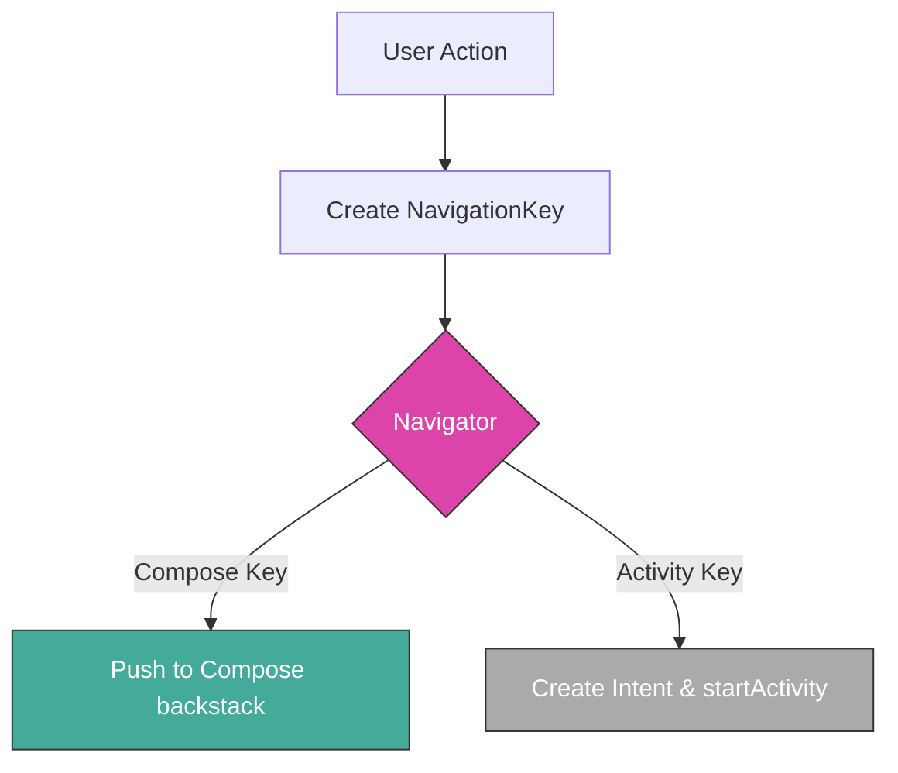
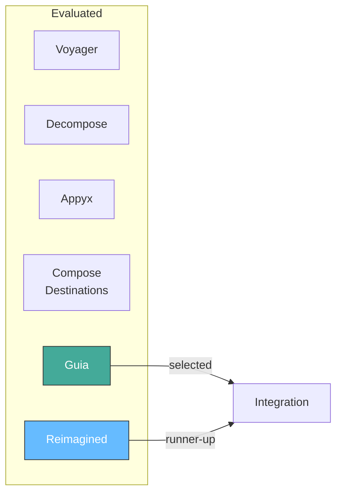
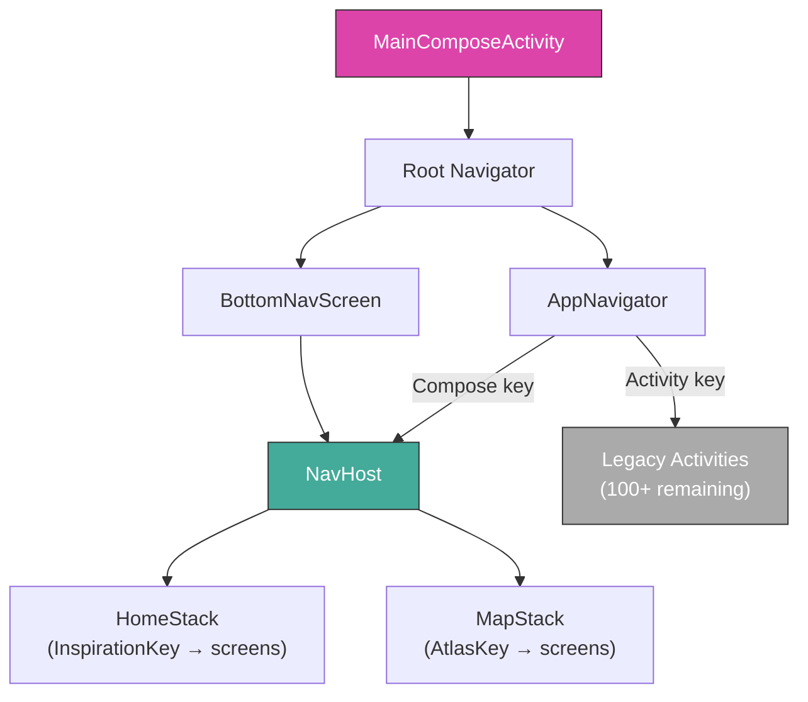

When you work on a large Android codebase long enough, you stop seeing activities and composables — you start seeing navigation patterns. Or more precisely, you start seeing the *absence* of a pattern.

At Komoot, the Android app had been growing for over a decade. The navigation code had evolved in three distinct waves, each reasonable in its moment, each leaving behind a layer of conventions that the next wave didn't fully replace. We had full Compose navigation using a custom library called Guia. We had activity-based navigation hidden behind interfaces and injected via Hilt. And we had the oldest layer: static intent factory methods living inside activity companion objects.

Three navigation systems, coexisting in one app. Not broken, exactly — but increasingly hard to reason about.

This is the story of how we analysed the problem, researched alternatives, and arrived at a solution built around a single idea: **navigation keys as the common language between all three worlds**.

## The three layers

To understand the problem, it helps to see how the codebase got here. Each approach reflected the best thinking of its era:


**Full Compose Navigation** was the newest layer — a single activity hosting all screens as composable functions, managed by our in-house framework called Guia. Type-safe, declarative, and the default for new features.

**Activity-based navigation with interfaces** was the middle layer — traditional `startActivity()` calls, but wrapped behind injectable interfaces so that different modules could trigger navigation without knowing the target activity class. This was already a step toward modularisation, and it worked reasonably well.

**Activity-based navigation with static methods** was the oldest and largest layer. The classic Android pattern: `ProfileActivity.start(context, userId)`. Simple and direct, but it created hard dependencies between modules. Any screen that wanted to navigate to `ProfileActivity` had to depend on the module containing it.

The first layer was roughly 15% of the codebase. The second, maybe 20%. The third, the remaining 65%. Over 156 activities still lived in the app.

## Where things got messy

The three approaches individually were fine. The problem was the space between them — the bridges, the interop code, and the organic growth that happens when there's no clear strategy for which approach to use when.

The interface layer was the most interesting case study. The *idea* was solid: hide navigation behind abstractions. But without a consistent strategy for how to draw boundaries, the interfaces had proliferated in confusing ways:

```
AtlasNavigation          → scoped to a full feature
IntentNavigation         → an abstract concept
RootNavigation vs AppNavigation  → duplicated?
RouteInfoIntentNavigation → intent factory, no navigation code
TouringPowerWarningIntentNavigation → device-specific logic leaking in
```

Some interfaces mapped to features. Some mapped to individual screens. Some were intent factories that didn't actually navigate anywhere. And because the interfaces were shared injection points, non-navigation code had a tendency to creep in:

```kotlin
interface TouringPowerWarningIntentNavigation {
    fun createXiaomiScreenIntent(): Intent
    suspend fun shouldShowXiaomiScreen(): Boolean
}
```

A `shouldShowXiaomiScreen()` method on a navigation interface — that's business logic wearing a navigation costume.

The practical consequence: developers working on a new screen sometimes needed to inject four or five different navigation interfaces, and they had no way to know if the method they needed already existed somewhere under a different name. `openSmartTour` appeared in both `AtlasNavigation` and `HighlightNavigation`. It was easy to create duplicates because there was no central registry of navigation capabilities.

## The key insight

While researching Compose navigation libraries for a separate effort (Project Arrow, which was bringing a major chunk of new Compose UI), I noticed something. Every modern navigation library converges on the same fundamental abstraction:

**A typed object that represents a destination, carrying all the data needed to reach it.**

Voyager calls them `Screen` objects. Appyx uses `Node` objects. Decompose has `Component` objects. Compose Destinations generates `Direction` objects. Our own Guia framework used `NavigationKey` — a `Parcelable` data class or object that lived on the backstack.

The terminology varied, but the concept was the same. And here's what made it interesting: this concept wasn't limited to Compose navigation. There was nothing stopping us from applying it to activity-based navigation too.

What if we created navigation keys for every destination in the app — Compose and activity-based alike? A single `NavigationKey` could serve as the common interface between all three navigation worlds. The Navigator would interpret the key and route it to the appropriate system.



The idea was simple: express all navigation complexity as data, not as imperative method calls scattered across dozens of interfaces.

## What a navigation key looks like

A key is just a `Parcelable` data class that carries everything a screen needs to start:

```kotlin
interface NavigationKey : Parcelable

@Parcelize
data class GuideKey(
    val guideId: String,
    val trackingCardId: String? = null,
    val trackingFeedInfo: String? = null
) : NavigationKey

@Parcelize
data class AtlasKey(
    val init: AtlasInitContent = AtlasInitContent.Default
) : NavigationKey

@Parcelize
data object ProfileKey : NavigationKey
```

For Compose destinations, these keys were already the native currency — Guia's backstack was a list of `NavigationKey` instances. But the same keys could also represent activity destinations. The Navigator would check the key type and either push it onto the Compose backstack or create an Intent and call `startActivity`:

```kotlin
class AppNavigatorImpl @Inject constructor(
    private val context: Context
) : AppNavigator {

    override fun navigate(
        navigationKey: NavigationKey,
        localNavigator: Navigator? = null
    ) {
        when (navigationKey) {
            // Compose destinations: push to the local or root navigator
            is AtlasKey -> localNavigator?.push(navigationKey)
            is InspirationKey -> localNavigator?.push(navigationKey)
            
            // Activity destinations: create intent and launch
            is RouteInfoKey -> {
                val intent = RouteInfoActivity.createIntent(
                    context, navigationKey.entityReference,
                    navigationKey.routeOrigin
                )
                context.startActivity(intent)
            }
            // ... more destinations
        }
    }
}
```

This meant features could navigate by creating a key — without knowing or caring whether the destination was a Compose screen or a legacy activity:

```kotlin
// In a feature module: doesn't know if GuideKey opens 
// a Compose screen or an Activity
appNavigator.navigate(GuideKey(guideId = "123"))
```

And the real payoff: once an activity was migrated to Compose, the calling code didn't change at all. The Navigator just routed the same key to the Compose backstack instead of `startActivity`.

## Fitting keys into a multi-module project

The navigation key approach worked well enough in a single module, but Komoot had dozens of feature modules that couldn't depend on each other. Cross-module navigation was the tricky part.

We explored two approaches:

**Option A: All keys in a shared navigation module.** Simple and direct. Every module depends on `:core:app-navigation`, and all keys live there. Any module can reference any key.

**Option B: Navigation key factories.** Each module defines its own keys privately and registers a factory. Other modules request keys through the factory interface, never touching the concrete types.

We went with a pragmatic version of Option A. The keys themselves were lightweight data classes — they didn't pull in any feature module dependencies, just plain Kotlin types and Parcelable. Defining them centrally in `:core:app-navigation` was straightforward:

```kotlin
// core/app-navigation/.../key/FeatureKeys.kt
@Parcelize data object RootKey : NavigationKey
@Parcelize data class InspirationKey(val payload: String? = null) : NavigationKey
@Parcelize data class AtlasKey(val init: AtlasInitContent) : NavigationKey
@Parcelize data class GuideKey(val guideId: String, ...) : NavigationKey
@Parcelize data class PlannerKey(val init: PlannerInit) : NavigationKey
@Parcelize data class ExploreKey(val init: ExploreInit) : NavigationKey
// ~30 more keys...
```

For cross-module navigation *logic* — where a feature needs to trigger navigation with side effects or complex setup — we kept the interface pattern, but now each interface was slim. Instead of methods with long parameter lists building intents, the interfaces mostly just wrapped key creation:

```
core:app-navigation              app-komoot
┌──────────────────────┐         ┌──────────────────────────┐
│ interface             │         │ @ActivityScoped           │
│ ExploreNavigation {   │◄────────│ class ExploreNavigationImpl│
│   fun navigateTo(...) │         │   @Inject constructor(...)│
│ }                     │         │   : ExploreNavigation     │
└──────────────────────┘         └──────────────────────────┘
```

Was the factory approach more architecturally pure? Probably. It scored higher on modularity, encapsulation, and scalability. But it also required more boilerplate, more interfaces, and more places to update when adding a screen. For a team that was already managing a major migration, the simpler path was the right one.

## The Guia framework

The navigation keys were the concept, but they needed a runtime to bring them to life in the Compose world. That runtime was Guia — a custom Compose-first navigation framework we built in-house, originally inspired by the open-source [Guia library](https://github.com/roudikk/guia) by Roudi Karkouche.

The choice of Guia came from a research phase where I compared several third-party libraries against our specific requirements:



The requirements were specific enough to eliminate most options quickly. We needed parcelable data in navigation parameters, multiple container types (full-screen, bottom sheet, dialog), nested navigation graphs with observable backstacks, custom lifecycle management, and Hilt ViewModel support. On top of that, the code needed to be easy to fork and customise — we knew we'd want to modify internals.

Decompose and Appyx were architecturally interesting but too generic — their abstractions were far from what the team expected, and integration would have been painful. Compose Destinations leaned heavily on annotation processing, which added compile time and made it harder to separate navigation from UI code. Voyager was the most feature-complete but was designed for multiplatform, making it too large to fork comfortably.

That left Guia and Reimagined as the two realistic candidates. Guia's code was shorter, more flexible, and supported different container types natively. Reimagined had better ViewModel scoping but lacked custom stack support. We went with Guia, forked it, and customised it for our needs.

The core of Guia is three concepts working together:

**NavigationKey** defines *where* to go (the data). **NavigationNode** defines *how* to display it (screen, dialog, or bottom sheet). **Navigator** manages the backstack as Compose state, so any change triggers recomposition:

```kotlin
val rootNavigator = rememberNavigator(
    initialKey = BottomNavKey,
) {
    screen<BottomNavKey> { BottomNavScreen(...) }
    screen<AtlasKey> { AtlasScreen(initContent = it.init) }
    bottomSheet<PlannerOptionsKey> { PlannerOptionsScreen() }
    
    keyTransition<SearchKey> { -> MaterialSharedAxisTransitionXY }
}

rootNavigator.NavContainer()  // renders the current top of the backstack
```

Navigation was just list manipulation — push, pop, replace — on a state-backed list:

```kotlin
navigator.push(GuideKey(guideId = "123"))
navigator.pop()
navigator.popToRoot()
navigator.singleInstance<PremiumKey>(PremiumKey())
```

For the multi-tab layout (Discover and Map tabs), `NavHost` managed multiple Navigator instances simultaneously, each identified by a `StackKey`:

```kotlin
val navHost = rememberNavHost(
    initialKey = HomeStackKey,
    entries = setOf(
        StackEntry(HomeStackKey, homeNavigator),
        StackEntry(MapStackKey, mapNavigator),
    ),
)
navHost.setActive(MapStackKey)
```

## The full picture

Putting it all together, the architecture looked like this:



`MainComposeActivity` was the single entry point for the Compose world. It hosted the root `Navigator`, which contained the bottom navigation screen. Inside that, a `NavHost` managed the tab stacks. And `AppNavigator` sat at the boundary — accepting any `NavigationKey` and routing it to the right system.

Deep links flowed through a `Destination` sealed class hierarchy, converted from URIs by `DeepLinkActivity`, and forwarded as keys to the appropriate stack navigator.

The legacy activities (still over 100) remained reachable through the same key mechanism. As each one was migrated to Compose, the migration was invisible to calling code — the key stayed the same, only the Navigator's routing logic changed.

## What Navigation 3 confirmed

After I left the project, Google announced [Jetpack Navigation 3](https://developer.android.com/guide/navigation/navigation-3) at I/O 2025. Reading through the API, I had a moment of quiet satisfaction.

Nav3's core abstraction is `NavKey` — a typed object representing a destination. The backstack is a `SnapshotStateList<T>` that the developer owns and controls. `NavDisplay` observes the list and renders the current destination. Navigation is adding and removing items from a list.

Sound familiar?

The parallels with what we built are almost exact:

| Concept | Guia (our implementation) | Navigation 3 |
|---------|--------------------------|--------------|
| Destination identity | `NavigationKey : Parcelable` | `NavKey` |
| Backstack | `List<BackstackEntry>` as `mutableStateOf` | `SnapshotStateList<T>` |
| UI container | `NavContainer()` composable | `NavDisplay()` composable |
| Screen registration | `screen<Key> { Content() }` DSL | `entryProvider { key -> NavEntry(key) { Content() } }` |
| Navigation actions | `navigator.push()`, `pop()`, etc. | `backStack.add()`, `removeLastOrNull()` |
| Multi-stack | `NavHost` with `StackKey` | Multiple backstacks |

I had a feeling that a modern navigation library from Google would converge on these same elements. Not because we were ahead of them — but because the Compose runtime itself pushes you toward this design. When your UI framework is built around observable state and recomposition, navigation naturally becomes "a list of typed destinations backed by Compose state."

The practical implication: migrating from Guia to Nav3 would be a relatively mechanical refactoring. The keys translate directly. The backstack model is equivalent. The registration DSL is similar. The team wouldn't need to rethink their navigation architecture — just swap the framework underneath.

That's the value of betting on the right abstraction rather than the right library.

## What I took away

This project reinforced something I keep rediscovering: the most impactful technical work isn't always the most complex. Navigation keys are a simple idea — typed data objects representing destinations. There's nothing clever about it. But applying that idea consistently across a fragmented codebase, making it work across module boundaries, and choosing the right trade-offs for a real team working under real constraints — that's where the work actually lives.

The research phase was worth the time. Evaluating six libraries against specific requirements, building proof-of-concept implementations for the top two, and understanding *why* each library made different trade-offs gave us confidence in our choice. When Guia needed customisation later, we understood its internals well enough to modify them without fear.

And the navigation key pattern itself turned out to be more durable than the framework hosting it. Keys outlived specific implementation choices, survived the bridge between Compose and Activities, and would have survived a migration to Nav3 if the project had continued. When you find an abstraction that maps cleanly to the problem domain, it tends to hold up regardless of what changes around it.