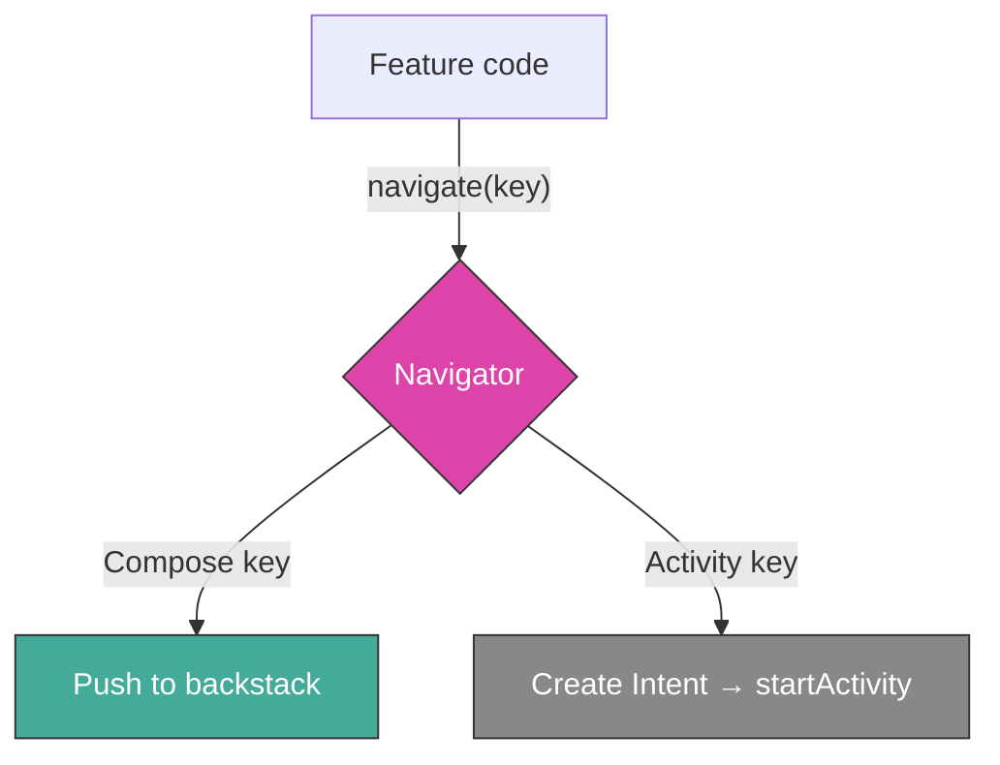

At Komoot, the Android app had three different navigation systems living side by side. Full Compose navigation managed by a custom framework. Activity-based navigation wrapped in injectable interfaces. And the oldest layer: static intent factory methods inside activity companion objects. Over 156 activities, decades of accumulated conventions, and no shared vocabulary between any of them.

None of the three systems were broken individually. The problem was the space between them — the interop code, the duplicated methods, the growing confusion about which approach to use for what. A new developer touching navigation code for the first time had to understand all three patterns and the bridges connecting them.

This is the story of arriving at a surprisingly simple solution: **a typed navigation key as the common language between all three worlds**, and a single `Navigator` interface that speaks it.


## The problem with many navigators

The middle layer — activity navigation behind interfaces — was the most revealing. The idea was reasonable: hide `startActivity()` calls behind abstractions so modules don't depend on each other's activities. But without a strategy for how to scope those interfaces, they had grown organically into something confusing:

```
AtlasNavigation          → scoped to a full feature
IntentNavigation         → an abstract concept
RootNavigation vs AppNavigation  → duplicated?
RouteInfoIntentNavigation → intent factory, no navigation
TouringPowerWarningIntentNavigation → ...what?
```

That last one is a good example of what happens when navigation interfaces become shared injection points without clear boundaries:

```kotlin
interface TouringPowerWarningIntentNavigation {
    fun createXiaomiScreenIntent(): Intent
    suspend fun shouldShowXiaomiScreen(): Boolean
}
```

Business logic wearing a navigation costume. And the practical cost was real: developers building a new screen sometimes needed to inject four or five different navigation interfaces, with no way to know if a method they needed already existed under a different name. `openSmartTour` lived in both `AtlasNavigation` and `HighlightNavigation`.

The root cause wasn't bad engineering — it was the lack of a unifying concept. Each interface was an ad-hoc bridge between modules. What we needed was a single abstraction that could represent *any* destination, regardless of whether it was a Compose screen or an Activity.

## The observation

While researching Compose navigation libraries for a parallel project, I noticed that every modern library converges on the same idea: **a typed object that represents a destination, carrying all the data needed to reach it.**

Voyager calls them `Screen` objects. Decompose uses `Component` objects. Our Compose framework (Guia) used `NavigationKey` — a `Parcelable` data class living on the backstack.

The terminology varied, but the pattern was identical. And crucially, there was nothing Compose-specific about it. A typed key carrying destination data could represent an Activity just as well as a composable screen.

What if `navigator.navigate(key)` was the only navigation API anyone needed to call?

## The pattern: key + navigator

The idea is small enough to fit in a diagram:



A navigation key is a `Parcelable` data class (or object) that carries everything a screen needs. The key itself is agnostic about *how* it will be displayed:

```kotlin
interface NavigationKey : Parcelable

@Parcelize
data class GuideKey(
    val guideId: String,
    val trackingCardId: String? = null
) : NavigationKey

@Parcelize
data class AtlasKey(
    val init: AtlasInitContent = AtlasInitContent.Default
) : NavigationKey

@Parcelize data object ProfileKey : NavigationKey
```

The Navigator interprets the key and routes it to the right system. For Compose destinations, it pushes the key onto the backstack. For Activity destinations, it builds an Intent and calls `startActivity`:

```kotlin
interface AppNavigator {
    fun navigate(
        navigationKey: NavigationKey,
        localNavigator: Navigator? = null
    )
    fun navigateUp()
}
```

The implementation is a `when` block that grows as you add destinations:

```kotlin
class AppNavigatorImpl @Inject constructor(
    private val context: Context
) : AppNavigator {

    override fun navigate(
        navigationKey: NavigationKey,
        localNavigator: Navigator?
    ) {
        when (navigationKey) {
            // Compose destinations
            is AtlasKey -> localNavigator?.push(navigationKey)
            is InspirationKey -> localNavigator?.push(navigationKey)
            is GuideKey -> localNavigator?.push(navigationKey)
            
            // Activity destinations
            is RouteInfoKey -> {
                val intent = RouteInfoActivity.createIntent(
                    context, navigationKey.entityReference,
                    navigationKey.routeOrigin
                )
                context.startActivity(intent)
            }
            // ... more destinations
        }
    }
}
```

From a feature module's perspective, navigation becomes one line — and it doesn't matter what's on the other side:

```kotlin
// Doesn't know (or care) if this opens a 
// Compose screen or an Activity
appNavigator.navigate(GuideKey(guideId = "123"))
```

That's the whole trick. All the complexity of three coexisting navigation systems is hidden behind a single method call. The key carries the data. The Navigator knows the routing.

## Why this works for migration

The real payoff shows up over time. When an Activity gets migrated to Compose, the calling code doesn't change. The key stays the same — only the Navigator's routing logic moves one branch from `startActivity` to `localNavigator.push`:

```kotlin
// Before migration: routes to Activity
is GuideKey -> {
    val intent = GuideActivity.createIntent(context, navigationKey.guideId)
    context.startActivity(intent)
}

// After migration: routes to Compose
is GuideKey -> localNavigator?.push(navigationKey)
```

Every feature module that calls `appNavigator.navigate(GuideKey(...))` keeps working without a single line changed. The migration is invisible to callers.

This also means the migration doesn't have to happen all at once. You can convert screens one by one, in any order, and the key layer absorbs the change. That mattered a lot in a codebase with 156 activities and a team that couldn't stop shipping features while refactoring.

## Keys in a multi-module codebase

Komoot had dozens of feature modules that couldn't depend on each other. The keys themselves lived centrally in `:core:app-navigation` — they're lightweight `Parcelable` data classes with no feature dependencies, so this worked cleanly:

```kotlin
// core/app-navigation/.../key/FeatureKeys.kt
@Parcelize data object RootKey : NavigationKey
@Parcelize data class InspirationKey(val payload: String? = null) : NavigationKey
@Parcelize data class AtlasKey(val init: AtlasInitContent) : NavigationKey
@Parcelize data class PlannerKey(val init: PlannerInit) : NavigationKey
@Parcelize data class ExploreKey(val init: ExploreInit) : NavigationKey
// ~30 more keys...
```

For navigation that required side effects or complex setup beyond just key creation, we kept slim interfaces in `:core:app-navigation` with implementations in the app module, wired via Hilt. But these interfaces were now thin wrappers — not the sprawling abstractions we started with.

We considered the alternative of key factories (each module defines its own keys privately and exposes them through a factory interface). It's more architecturally pure, but it adds boilerplate for every new screen. For a team already managing a big migration, simplicity won.

## The Compose side

On the Compose side, the keys needed a runtime to manage the backstack, render screens, and handle transitions. After [evaluating several open-source libraries](/blog/2024/XX/XX/guia-selection.html), we forked and customised [Guia](https://github.com/roudikk/guia) — a Compose-first navigation framework where the backstack is just a list of keys backed by Compose state.

The important point for this article isn't Guia's internals — it's that Guia already used `NavigationKey` as its native unit. The same key type that the `AppNavigator` routes to Activities is the same key type that Guia puts on its backstack. No adapters, no mapping layer. One key definition, two consumers.

## The abstraction outlives the framework

The navigation key pattern turned out to be more durable than any specific framework hosting it. Keys bridged the gap between Activities and Compose. They'd survive a migration to any future Compose navigation library — including [Jetpack Navigation 3](https://developer.android.com/guide/navigation/navigation-3), which Google released after I left the project, and which uses almost the same model: typed keys on a state-backed list.

That wasn't a coincidence. The Compose runtime pushes you toward this shape: when your UI is built around observable state and recomposition, navigation naturally becomes a list of typed destinations. Any key-based Compose library is a valid consumer of the same keys that route to Activities today.

The lesson I keep coming back to: when you find an abstraction that maps cleanly to the problem — a destination is just typed data — it holds up regardless of what changes around it. The key doesn't care if it's consumed by Guia, Nav3, or a `when` block building Intents. It just carries data to a destination.