In my [first post](https://monday8am.com/blog/2025/10/01/flat-notifications-edge-ai.html), I built a prototype for context-aware notifications using an on-device language model. In the [second](https://monday8am.com/blog/2025/12/10/function-calling-edge-ai.html), I tried to make that model call tools — and hit a wall. Then, one week after publishing, Google released [FunctionGemma](https://ai.google.dev/gemma/docs/functiongemma): a Gemma 3 270M model specifically fine-tuned for function calling.

Finally, a small model designed to do exactly what I needed. So I did what any excited developer would do: I started looking for the perfect use case.

I spent weeks evaluating scenarios. Context-aware notifications. Hiking safety copilots. Cycling route re-planners. Voice-controlled outdoor companions. Each time, I'd get excited about the architecture, sketch out the tool definitions, and then arrive at the same uncomfortable conclusion:

**Deterministic code would do this better.**

This post is about that realization — and the decision tree I built to stop myself from repeating the same mistake.

## FunctionGemma in 30 Seconds

FunctionGemma is a 270M parameter model built on Gemma 3, fine-tuned specifically for function calling. Google positions it as a **local traffic controller**: a lightweight model that runs on-device, handling frequent simple commands and only escalating complex requests to cloud models.

The key specs from the [model card](https://ai.google.dev/gemma/docs/functiongemma/model_card):

- **Base accuracy**: 58% on the Mobile Actions benchmark
- **After fine-tuning**: 85% on the same benchmark
- **Size**: 288 MB (dynamic int8 quantization)
- **Latency**: 0.3s time-to-first-token on a Samsung S25 Ultra
- **Memory**: ~551 MB peak RSS

Google provides two demo use cases: [Tiny Garden](https://play.google.com/store/apps/details?id=com.google.ai.edge.gallery) (a voice-controlled gardening game) and [Mobile Actions](https://ai.google.dev/gemma/docs/mobile-actions) (translating commands like "turn on the flashlight" into system API calls). Both ship with fine-tuning recipes.

The model is explicitly **not intended for zero-shot use**. Google's own documentation says: you need to fine-tune for your specific task. That 58% → 85% jump after fine-tuning isn't optional — it's the whole point.

## What Google Gets Right

The framing is honest. Google doesn't oversell FunctionGemma as a general-purpose agent. The documentation lists clear prerequisites:

- **You have a defined API surface** — a bounded set of actions
- **You are ready to fine-tune** — not just prompt engineering
- **You prioritize local-first deployment** — latency and privacy matter
- **You are building compound systems** — the small model handles simple routing, bigger models handle the rest

Both demo use cases fit this description perfectly. "Turn on the flashlight" maps to a single API call. "Plant sunflowers in the top row" maps to a game function with coordinates. These are bounded, local, failure-tolerant tasks.

But here's where it gets interesting: **those same tasks could be solved with a simple intent classifier.** Or a regex. Or a dropdown menu.

The language model adds marginal value when the action space is this constrained. Google knows this — they're betting on the model becoming more capable over time, and the fine-tuning recipe scaling to more complex domains. The demos are a starting point, not the destination.

The question is: what's the destination?

## The Reality Check

I tried to answer that question by building real use cases. Here's what happened.

### Attempt 1: Context-aware notifications (Article 1)

The idea: use an on-device model to generate personalized meal reminders based on weather, time, location, and logging history. Instead of "Time for a snack?" you'd get "Nice pace today — a gazpacho would hit right in this heat 💪".

**Why FunctionGemma doesn't fit**: The model needs to *generate* creative, contextual text — that's open-ended language generation, not function calling. You'd need tool calls to gather context (weather, meal history), but the actual value is in the generation step, which requires a larger model. And honestly, you could gather that context with deterministic code and just template the output.

### Attempt 2: Hiking safety copilot

The idea: combine GPS, weather, elevation, and pace data to proactively alert hikers about risks. The model would decide which data sources to query and synthesize alerts.

**Why FunctionGemma doesn't fit**: Every part of this pipeline is better served by deterministic logic. Deciding which sensors to read? That's a decision tree. Computing risk levels from sensor data? That's arithmetic and thresholds. Presenting alerts to a hiker? They're glancing at a watch while moving — they need a dashboard, not a conversation. And critically: **an 85% accuracy rate is not acceptable when safety is at stake.**

### Attempt 3: Cycling mid-route re-planning

The idea: a cyclist mid-ride says "I'm tired, find me a flatter way to the campsite" and the model interprets the constraint, calls a routing API, and presents alternatives.

**Why FunctionGemma doesn't fit** — but it's complicated: This is actually the most promising scenario. The language input is genuinely ambiguous ("flatter" is subjective, "tired" implies preference changes). The output is structured (a route). But the blocker is practical: **route computation requires a routing engine**, and running one locally on a phone isn't feasible. The algorithms are complex, the map data is massive, and you need network access anyway. If you need the network for the hard part, do you really need an on-device model for the easy part (intent classification)?

### The pattern

Each attempt followed the same arc: exciting architecture → honest evaluation → deterministic code wins. The model is either doing something too simple (where a classifier suffices) or something too complex (where it can't deliver reliably).

This isn't a failure of FunctionGemma specifically. It's a **structural challenge** with sub-1B models on mobile devices in early 2026.

## The Decision Tree

After enough failed attempts, I built a decision tree to formalize the evaluation. It's inspired by Google's [Compose Animation decision tree](https://developer.android.com/develop/ui/compose/animation/introduction) — a practical tool that helps developers pick the right approach instead of guessing.

```mermaid
flowchart TD
    START([🤔 I have a mobile feature idea<br/>that could use AI]) --> Q1

    Q1{Does the feature require<br/>natural language<br/>understanding?}
    Q1 -->|No| D1_DESC[Rule engines, algorithms,<br/>and structured logic are<br/>more reliable and efficient] --> D_COMMON[✅ Use deterministic code]
    Q1 -->|Yes| Q2

    Q2{Is the input from<br/>the user in<br/>natural language?}
    Q2 -->|No| D2_DESC[Structured inputs like sensors,<br/>GPS, buttons, or toggles<br/>don't need language models] --> D_COMMON
    Q2 -->|Yes| Q3

    Q3{Can the task be solved<br/>with a finite set of<br/>predefined actions?}
    Q3 -->|No| D3[☁️ Use a cloud LLM<br/>Open-ended generation,<br/>complex reasoning, and<br/>creative tasks exceed<br/>on-device model capacity]
    Q3 -->|Yes| Q4

    Q4{Is failure tolerable?<br/>Can you retry or<br/>fall back gracefully?}
    Q4 -->|No| D4_DESC[Safety-critical, financial,<br/>or medical decisions need<br/>100% reliability, not 85%] --> D_COMMON
    Q4 -->|Yes| Q5

    Q5{Can all processing<br/>happen on-device?}
    Q5 -->|Yes| Q6
    Q5 -->|No| Q7

    Q6{Are you ready<br/>to fine-tune?}
    Q6 -->|No| D5[⏸️ Wait or reconsider<br/>Base FunctionGemma scores<br/>58% without fine-tuning.<br/>Not reliable enough for<br/>production use]
    Q6 -->|Yes| Q9{Is the task<br/>fully local?}

    Q7{Does on-device routing<br/>add real value before<br/>the remote call?}
    Q7 -->|No| D7[☁️ Use a cloud LLM directly<br/>If you need the network anyway<br/>and routing is simple, skip<br/>the on-device overhead]
    Q7 -->|Yes| Q6

    Q9 -->|Yes| D6[📱 FunctionGemma<br/>fine-tuned for your tools<br/>The sweet spot: bounded API,<br/>local-first, failure-tolerant]
    Q9 -->|No| D8[📱☁️ FunctionGemma as router<br/>+ cloud backend<br/>Local intent classification,<br/>remote execution via<br/>agent orchestration]

    classDef green fill:#c0f8d066,stroke:#c0f8d0,stroke-width:2px,color:black
    classDef blue fill:#c7dcfc66,stroke:#c7dcfc,stroke-width:2px,color:black
    classDef yellow fill:#f7f8c066,stroke:#f7f8c0,stroke-width:2px,color:black
    classDef red fill:#ffc0cb66,stroke:#ffc0cb,stroke-width:2px,color:black
    linkStyle default stroke:black,stroke-width:2px,color:black

    class START red
    class Q1,Q2,Q3,Q4,Q5,Q6,Q7,Q9 blue
    class D_COMMON,D1_DESC,D2_DESC,D4_DESC green
    class D3,D7 yellow
    class D6,D8 green
    class D5 red
```    

The tree has six decision points, each based on a real lesson:

**1. Does the feature require natural language understanding?**
If not, use deterministic code. Sensor processing, data pipelines, and rule engines don't need language models. *Example: hiking safety alerts exit here.*

**2. Is the input from the user in natural language?**
If not, use deterministic code. Structured inputs — buttons, toggles, GPS coordinates — are better handled by traditional UI patterns. *Example: dashboard interfaces exit here.*

**3. Can the task be solved with a finite set of predefined actions?**
If not, consider a cloud LLM. Open-ended generation, creative writing, and complex reasoning exceed what a 270M model can deliver. *Example: creative notifications exit here.*

**4. Is failure tolerable?**
If not, use deterministic code. Safety-critical, financial, or medical decisions need 100% reliability. An 85% accuracy rate means 1 in 7 calls could be wrong. *Example: safety-critical outdoor decisions exit here.*

**5. Can all processing happen on-device?**
This is the fork. If yes, you're in FunctionGemma territory (with fine-tuning). If no, ask: does on-device routing add real value before the remote call? If the routing is simple enough that a few `if` statements could handle it, skip the on-device overhead and call the cloud directly. *Example: cycling re-planning exits here — routing needs a server anyway.*

**6. Are you ready to fine-tune?**
If not, wait. The base model at 58% isn't reliable enough for production. This isn't a criticism — Google says the same thing. Fine-tuning is the product, the base model is just the starting material.

### Where FunctionGemma lands

The tree has two green paths for FunctionGemma:

- **📱 Fully local**: Bounded API surface, on-device processing, fine-tuned for your specific tools. This is Google's sweet spot — Mobile Actions and Tiny Garden live here.
- **📱☁️ Router + cloud**: Local intent classification dispatching to remote services. FunctionGemma parses the user's request, Koog (or another framework) orchestrates the tool calls, and a cloud model handles anything complex.

Both paths require fine-tuning. Both require a clearly bounded action space. And both require that failure is tolerable — the system should retry or fall back gracefully, not crash.

## The Uncomfortable Middle

Here's what the tree reveals: **the sweet spot for FunctionGemma on mobile is narrow.**

The fully local path (Mobile Actions, Tiny Garden) works, but the use cases are ones where simpler approaches also work. "Turn on the flashlight" doesn't need a language model. It needs a voice command parser, and those have existed for a decade.

The router path is more interesting architecturally, but it's hard to find scenarios where on-device intent classification adds enough value over a simple API call to justify the 288 MB model download and 551 MB runtime memory.

I'm not saying the model is useless — I'm saying the ecosystem around it (runtimes, tooling, model capabilities) hasn't matured enough to unlock the use cases where it would genuinely shine. Google's own documentation hints at this: FunctionGemma is positioned as a **foundation for further training**, not a drop-in solution.

## What I Learned

**Deterministic code is underrated.** In the AI hype cycle, it's easy to forget that `if/else` statements are fast, reliable, testable, and free. Every use case should start with the question: "Can I solve this without a model?"

**The constraint triangle is real.** On-device AI use cases need three things simultaneously: natural language input (otherwise deterministic UI wins), local processing (otherwise why not use the cloud), and bounded complexity (otherwise the model can't handle it). Finding all three in one feature is genuinely hard.

**Infrastructure is ahead of use cases.** My testing platform, the Koog integration, the model conversion pipeline — all of it works. The architecture is ready. What's missing isn't tooling; it's a compelling reason to use it. And that's okay. The same was true for GPS on phones before someone thought of ride-sharing.

**Fine-tuning is not optional.** Every experiment reinforced this. The base model's 58% accuracy is a starting point for training, not a production baseline. If you're evaluating FunctionGemma and not planning to fine-tune, you're evaluating the wrong thing.

## What's Next

I'm going to build the router pattern anyway. Not because I've found the perfect use case, but because demonstrating the integration — FunctionGemma dispatching to Koog orchestrating tool calls across local and remote services — has value as a reference implementation. The [testing platform](https://github.com/monday8am/koogagent) I've been developing is the right place for this.

The ecosystem is moving fast. LiteRT-LM is stabilizing, FunctionGemma has fine-tuning recipes, and Google is actively developing the edge AI stack. When the models get more capable and the runtimes more stable, the patterns I've been documenting will be ready.

Or maybe the killer use case will be something none of us have thought of yet. That's usually how it works.

### Links

- [FunctionGemma overview](https://ai.google.dev/gemma/docs/functiongemma)
- [FunctionGemma model card](https://ai.google.dev/gemma/docs/functiongemma/model_card)
- [Mobile Actions fine-tuning recipe](https://ai.google.dev/gemma/docs/mobile-actions)
- [KoogAgent repository](https://github.com/monday8am/koogagent)
- [From flat Notifications to Edge AI](https://monday8am.com/blog/2025/10/01/flat-notifications-edge-ai.html)
- [Researching Tool Calling in On-Device AI](https://monday8am.com/blog/2025/12/10/function-calling-edge-ai.html)
- [Berkeley Function-Calling Leaderboard](https://gorilla.cs.berkeley.edu/leaderboard.html)
- [Google AI Edge Gallery](https://play.google.com/store/apps/details?id=com.google.ai.edge.gallery)
